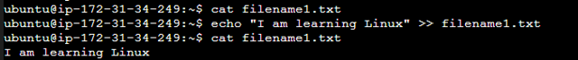
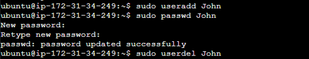

# **LINUX PRACTICE PROJECTS**

## **Prerequisite**

- Basic Understanding of the Linux Command Line
- A Linux Environment or Virtual Machine

# **File Manipulation**

## **1. sudo command:**

The `sudo` command on Linux is a powerful and essential tool that allows users to run commands with the security privileges of another user, usually the superuser (root). It stands for "superuser do."

To use the `sudo` command, simply type `sudo` followed by the command you want to run. The system will then prompt you for your password. Once you enter your password, the command will be run with elevated privileges.

For example, the `sudo apt upgrade` command is used to upgrade already installed packages to the latest version 

Another example is the `sudo -k apt update` command which is useful if you want to check for updates without actually installing them. This can be useful if you are not sure if you want to install the updates, or if you are concerned about the impact of the updates on your system. If there are any updates available, the `sudo -k apt` update command will print a list of the updates. However, the updates will not be installed. To install the updates, you can run the `sudo apt upgrade` command.

## **2. pwd command:**

The `pwd` command stands for "print working directory". When you run `pwd`, it prints the current directory or the absolute path of the current working directory in the terminal. In the below example, the working directory is `/home/ubuntu`

## **3. cd command:**

The `cd` command stands for "change directory". It is used to change the current working directory. The syntax for the `cd` command is: `cd <Directory>`. In the image below, the `pwd` command was used to print the current working directory, which is `/home/ubuntu`. The `ls` command was used to list the files and folders in the working directory. Then, the `cd` command was used to change the working directory to `/Shevy`. The `ls` command was used again to list the files and folders in the working directory, which now shows that the directory has changed to `/Shevy`.

## **4. ls command:**

The `ls` command lists the contents of a directory. By default, the `ls` command lists the contents of the current working directory. 

It also displays information about the files and directories such as names, sizes, permissions, and modification times. Here are some other commands and what they do.

- `ls -a`: The `-a` option shows hidden files (those starting with a dot).

- `ls -l`: The `-l` option displays a detailed listing with additional information like permissions, number of links, owner, group, size, and modification time.

- `ls -h`: does the same thing as `ls`

- `ls -lh`: The `ls -lh` command lists the contents of a directory in a human-readable format, with long output. This means that the file sizes are displayed in KB, MB, or GB, and additional information about the files and directories is also displayed, such as the permissions, modification date, and owner.

- `ls -R`: The `ls -R` command lists the contents of a directory and all of its subdirectories recursively. This means that it will list all of the files and directories in the current directory, and then it will list all of the files and directories in each of those subdirectories, and so on.

## **5. cat command:**

The `cat` command is a Linux command that is used to display the contents of a file or files. It can also be used to concatenate multiple files into a single file.

In the image example, the `cat` command was used to display the contents of the file `filename1.txt`, but it returned no output, indicating that the file was empty. The `echo` command was then used to input the text "I am Learning Linux" into the file `filename1.txt`. When the `cat` command was run again on the file, it displayed the output "I am Learning Linux", which is the text that was inputted using the `echo` command. 

 

In the below illustration, the command `cat filename1.txt filename2.txt > filename5.txt` was used to concatenate the contents of the files `filename1.txt and filename2.txt` and store the output in the file `filename5.txt`. This command is useful for merging multiple files into a single file, or for creating a new file containing the contents of two or more existing files as shown below.

 

## **6. cp command:**

The `cp` command is used to copy files and directories. It can be used to copy files and directories within the same directory, or to copy them to a different directory.

In the below illustration, The command `cp filename1.txt filename2.txt filename3.txt /Ajibola` will copy the files `filename1.txt`, `filename2.txt`, and `filename3.txt` to the directory `/Ajibola`.

Note: If the directory `/Ajibola` does not exist, it will be created. If any of the files `filename1.txt`, `filename2.txt`, or `filename3.txt` already exist in the directory `/Ajibola`, they will be overwritten without prompting.

The `cp -R` command is used to copy directories and all of their contents recursively. The `-R` option stands for "recursive". To use the `cp -R` command, you simply specify the source directory and the destination directory. In the below illustration, the `cp -R Ajibola/ Backup_Ajibola` command was used to recursively copy the directory `Ajibola/` and all of its contents to the directory `Backup_Ajibola`. This means that all of the files and subdirectories in `Ajibola/` will be copied to `Backup_Ajibola/`, preserving the directory structure.

Note: If the directory `Backup_Ajibola` does not exist as shown in the image below, it will be created. If any of the files or directories in `Backup_Ajibola` already exist, they will be overwritten

## **7. mv commmand:**

The `mv` command in Linux is used to move or rename files and directories. It allows you to change the location of a file or directory within the filesystem or change its name.

In the image below, the `mv` command was used to move files from the home directory into `Ajibola/` directory. 

In the below example, the command `mv filename4.txt new_filename4.txt` was used to rename the file `filename4.txt` to `new_filename4.txt`. If the file `new_filename4.txt` already exists, it will be overwritten.

## **8. mkdir commmand:**

The `mkdir` command is used to create directories. It is a very simple command to use, and it can be very useful for organizing your files. To create a directory, simply specify the name of the directory you want to create. In the image below, the `mkdir` was used to create `Light` directory

## **9. rmdir command:**

The `rmdir` command is used to remove empty directories. It is a very simple command to use, but it is important to note that it cannot be used to remove non-empty directories.

To remove an empty directory, simply specify the name of the directory you want to remove. For example, to remove the directory `Light`, you would use the command `rmdir Light` as shown below

The `rmdir -p` command is used to remove directories, including any parent directories that become empty after removing a subdirectory. For example, the `rmdir` command was used to remove the `Songs` directory as well as the `Music` directory in the image below.

 

## **10. rm command:**

The `rm` command is used to remove files and directories. It is a very powerful command, but it is important to use it carefully, as there is no way to recover a file once it has been removed. In the image below, the `rm` command was used to remove the `new_filename4.txt` file

The `rm` command can also be used to remove multiple files. in the image below, the `rm` command was used to remove both the `Manager` and `filename.txt` file

## **11. touch command:**

The `touch` command is used to create empty files and to update the timestamps of existing files. To create a new file using the `touch` command, simply specify the name of the file you want to create. For example, to create a new file called filename4.txt, you would use the following command:

## **12. locate command:**

The `locate` command is used to search for files by name. It is a very fast command, as it uses a database of file names that is updated regularly.

To use the `locate` command, simply specify the name of the file you want to search for. For example, to search for files with the name `filename`, you would use the following command:

The `locate` command will return a list of all of the files that match the search pattern. The `locate -i` command in Linux is used to search for files by name, ignoring case. This means that it will match both uppercase and lowercase letters, regardless of the order in which they appear.

To use the `locate -i` command, simply specify the name of the file you want to search for. For example, to search for files with the name `filename`, regardless of whether it is capitalized or not, you would use the following command:

## **13. find command:**

The `find` command is used to search for files and directories based on a variety of criteria, such as name, size, date, and permissions. It is a very powerful tool, and it can be used for a wide variety of tasks.

To use the `find` command, you simply specify the directory you want to search and the criteria you want to use. For example, to find all of the files in the current directory and its subdirectories that have the `.txt` extension, you would use the following command:

If you want to find a particular file name, you can specify as shown below:

To find all of the files in the current directory and its subdirectories that were created in the 7 days or the last month, you would use the following command: 

To find all of the files in the current directory and its subdirectories that contain the word "`filename`": you would use the following command: 

## **14. grep command:**

The `grep` command is used to search for patterns in text files. It is a very powerful tool, and it can be used for a wide variety of tasks, such as searching for specific words or phrases in log files, configuration files, or source code.

To use the `grep` command, you simply specify the pattern you want to search for and the file or files you want to search. For example, to search for the word "learning" in the file filename1.txt, you would use the following command:

## **15. df command:**

The `df` command in Linux is used to display information about the disk space available on a file system. It is a very useful tool for monitoring disk space usage and ensuring that you do not run out of space.

To use the `df` command, simply type it into a terminal window. The command will then display a list of all of the mounted file systems on your system, along with the following information:

- File system: The name of the file system.
- Size: The total size of the file system in kilobytes.
- Used: The amount of used space on the file system in kilobytes.
- Available: The amount of available space on the file system in kilobytes.
- Use%: The percentage of the file system that is used.
- Mounted on: The directory where the file system is mounted.

The `df -h` command is used to display information about the disk space available on a file system in human-readable format. This means that the output of the command is displayed in units of kilobytes (KB), megabytes (MB), and gigabytes (GB), instead of the raw kilobyte values that are displayed by the default `df` command. 

The `df -m` command is used to display information about the disk space available on a file system in megabytes (MB). This means that the output of the command is displayed in units of MB, instead of the raw kilobyte values that are displayed by the default `df` command. Check the below image to see how the command works

## **16. du command:**

The `du` command is used to display the disk usage of files and directories. It is a very useful tool for tracking disk space usage and identifying files or directories that are taking up a lot of space.

To use the `du` command, simply type it into a terminal window, followed by the name of the file or directory you want to inspect. For example, to display the disk usage of the directory `Shevy/`, you would use the following command:

Adding a flag to the `du` command will modify the operation, such as:

-s offers the total size of a specified folder.
-m provides folder and file information in MB k displays information in KB.
-h informs the last modification date of the displayed folders and files.

## **17. head command:**

The `head` command is used to display the beginning of a text file or piped data. It is useful for quickly getting a sense of the contents of a file or for viewing the first few lines of a large file.

To use the `head` command, simply type it into a terminal window, followed by the name of the file you want to inspect. For example, to display the first 10 lines of the file `filename4.txt`, you would use the following command:

## **18. tail command:**

The `tail` command is used to display the end of a text file or piped data. It is useful for quickly seeing the most recent changes to a file or for viewing the last few lines of a large file.

To use the `tail` command, simply type it into a terminal window, followed by the name of the file you want to inspect. For example, to display the last 10 lines of the file `filename4.txt`, you would use the following command:

## **19. diff command:**

The `diff` command in Linux is used to compare two files or directories and display the differences between them. It is a very useful tool for debugging code, tracking changes to files, and merging changes from multiple sources.

To use the `diff` command, simply type it into a terminal window, followed by the names of the two files or directories you want to compare. For example, to compare the files filename1.txt and filename2.txt, you would use the following command:

## **20. tar command:**

The `tar` command in Linux is used to create and extract archive files. Archive files are compressed files that contain one or more files bundled together for more accessible storage and portability.

The `tar` command is a very versatile tool and can be used to create and extract archive files in a variety of formats.

For example, The command `tar -cvf myarchive1.tar new_filename.txt` will create a tar archive file called `myarchive1.tar` containing the file `new_filename.txt`. What this mean is that, if you have a file called `new_filename.txt` in the current directory, running the command `tar -cvf myarchive1.tar new_filename.txt` will create a tar archive file called `myarchive1.tar` in the current directory. The tar archive file will contain the file `new_filename.txt`.

The command `tar -tf myarchive1.tar` will list the contents of the tar archive file `myarchive1.tar` to the standard output. The `-t` option tells the tar command to list the contents of the archive file, and the `-f` option tells the tar command to read the archive file from the specified filename.

## **21.chmod command:**

The chmod command is used to change the permissions of files and directories. It stands for change mode.

The chmod command takes two arguments: the permissions to set and the file or directory to change the permissions of. The permissions are specified as a three-digit number, where each digit represents a different permission:

- The first digit represents the owner's permissions.
- The second digit represents the group's permissions.
- The third digit represents the permissions for everyone else.

Some common permissions that you can set with the chmod command:

777	- Everyone has read, write, and execute permissions.

755 - The owner has read, write, and execute permissions. The group has read and execute permissions. Everyone else has read permission.

644 -	The owner has read and write permissions. The group has read permission. Everyone else has no permissions.

640 -	The owner has read and write permissions. The group and everyone else have no permissions.

In the below example, `chmod 777 filename1.txt` was used set the permissions of the file filename1.txt so that the owner, group, and everyone else have read, write, and execute permissions. This is the most permissive set of permissions that can be set on a file.the `ls -ltr` command was used to used to list the contents of a directory in long format, sorted by last modified time in reverse order. This means that the most recently modified files and directories will be listed at the top.

## **22. chown command:**

The chown command is used to change the owner of a file or directory. It stands for change owner.

The chown command takes two arguments: the new owner and the file or directory to change the ownership of. The new owner can be specified as a username or a user ID. The file or directory can be specified as a relative or absolute path.

To change the owner of a file or directory, simply type the chown command followed by the new owner and the file or directory to change the ownership of. For example, the command `chown Shevy filename2.txt` will change the owner of the file `filename2.txt` to the user Shevy. However, since you are not running this command with root privileges, you will get an error message.

To change the owner of a file or directory, you need to have root privileges. You can do this by running the chown command with the sudo command as shown below.

If you check the `ls -l filename2.txt` command in the above image, you will see the ownership for has changed to `Shevy`

## **23. jobs command:**

The `jobs` command is used to list the jobs that you are running in the background and in the foreground. It is a useful tool for tracking the status of your jobs and for managing them.

To use the `jobs` command, simply type it into a terminal window. The output of the command will be a list of all of your current jobs, with their job numbers and statuses.

The status of a job can be one of the following:

- Running: The job is currently running.
- Stopped: The job has been stopped.
- Sleeping: The job is waiting for input or resources.
- Done: The job has finished running.

The command `sleep 10 &` starts a new process that will sleep for 10 seconds and then exit. Then the Jobs command was used to list the jobs running and their status

## **24. kill command:**

The `kill` command in Linux is used to send a signal to a running process. The signal can be used to terminate the process, stop the process, or continue the process.

To use the `kill` command, simply type it into a terminal window, followed by the signal number and the process ID (PID) of the process you want to send the signal to. You can find the PID of a process using the `ps` command.

The most common signal that is used with the `kill` command is the `SIGTERM` signal, which tells the process to terminate gracefully. If the process does not terminate gracefully after receiving the `SIGTERM` signal, you can send it the SIGKILL signal, which tells the process to terminate immediately. To send the `SIGKILL` signal to a process with the PID, you would use the following command:

  

  kill [Signal_option] pid. In the example above `kill -9 31379` was used to kill the job with PID 31379

  

The command `kill %3` in the above image was used to send the `SIGTERM` signal to the third job in your current session. The `SIGTERM` signal is a signal that tells the process to terminate gracefully.

## **25. ping command:**

The `ping` command in Linux is used to test the reachability of a host on an Internet Protocol (IP) network. It is a useful tool for troubleshooting network problems and for verifying that a host is online and accessible.

To use the `ping` command, simply type it into a terminal window, followed by the IP address or hostname of the host you want to ping. For example, to ping the host with the IP address `8.8.8.8` (Google IP), you would use the following command:

You can also ping a website host. The ping `darey.io` command will send a series of packets to the host `darey.io` and wait for a response. If the host is online and accessible, the ping command will display the output similar to this:

## **26. wget command:**

The `wget` command is a command-line utility that downloads files from the web. It supports the HTTP, HTTPS, FTP, and SFTP protocols. `wget` is a powerful tool that can be used to download files from a variety of sources, including web servers, FTP servers, and HTTP proxies.

To use the `wget` command, simply type it into a terminal window, followed by the URL of the file you want to download. For example, to download the file index.html from the website `darey.io`, you would use the following command:

## **27. uname command:**

The `uname` command in Linux is used to print information about the current system, such as the operating system name, kernel release number and version, machine architecture, etc. It is a useful tool for system administrators and developers who need to quickly obtain information about the system they are working on.

Here are some additional tips for using the uname command:

- You can use the -a option to display all of the available information about the system.

- You can use the -s option to display the operating system name.

- You can use the -v option to display more detailed information about the system.

- You can use the -r option to display the kernel release number and version.

- You can use the -m option to display the machine architecture.

- You can use the -n option to display the system's node name (hostname).

## **28. top command:**

The `top` command is a real-time system monitoring tool that displays the CPU, memory, process, and other system information. It is a powerful tool for system administrators and developers who need to monitor the performance of their systems and identify potential problems.

To use the `top` command, simply type it into a terminal window. The top command will display a real-time view of the system's CPU, memory, process, and other system information.

## **29. history command:**

The `history` command is used to display a list of the commands that have been executed in the current terminal session. It is a useful tool for tracking the commands that you have run and for re-running commands without having to type them out again.

To use the history command, simply type it into a terminal window. The history command will display a list of all of the commands that have been executed in the current terminal session, with their command numbers.

## **30. man command:**

The `man` command is used to display the manual page for a command or function. Manual pages are text files that contain detailed information about commands and functions, such as their syntax, arguments, and examples.

To use the `man` command, simply type it into a terminal window, followed by the name of the command or function you want to learn about. For example, to display the manual page for the ls command, you would type the following command: `man ls` which will give you the output below

## **31. echo command:**

The echo command is used to print text to the console. It is a simple but powerful command that can be used for a variety of tasks, such as printing messages, debugging scripts, and creating files.

To use the echo command, simply type it into a terminal window, followed by the text you want to print. For example, the command `echo 'Life is good' > new_filename.txt` will create a new file called `new_filename.txt` with the text "Life is good" inside it.

The `echo` command is used to print text to the console or to a file. The `>` symbol is used to redirect the output of a command to a file.

In this case, we are redirecting the output of the `echo` command to a new file called `new_filename.txt`. This will create the file if it does not exist, or overwrite it if it already exists.

## **32. zip,unzip commands:**

The `zip` command is a command-line tool that is used to create archive files. Archive files are compressed files that contain multiple files and directories. The `zip` command is a useful tool for reducing the size of files and for making them easier to share.

To use the `zip` command, simply type it into a terminal window, followed by the name of the archive file you want to create and the names of the files and directories you want to archive. For example, to create an archive file called my_archive.zip that contains the files file1.txt and file2.txt, you would type the following command:

For example, the command `zip Devops_Boss.zip new_filename.txt`will create a new file called `Devops_Boss.zip` in the current directory, which will contain the compressed contents of the file `new_filename.txt`.

The `unzip` command is a command-line tool that is used to extract files from archive files. The `unzip` command is a useful tool for extracting files from archive files that have been created using the `zip` command or other archive file utilities.

The `unzip -l` command is used to list the contents of an archive file without extracting them. This is a useful command for viewing the contents of an archive file before extracting it, or for verifying that the archive file contains the files you expect.

## **33. hostname command:**

The `hostname` command is used to print the system's hostname. The hostname is the name that the system uses when communicating with other devices on the network.

To use the `hostname` command, simply type it into a terminal window. The hostname command will print the system's hostname to the console.

Here are some additional tips for using the hostname command:

You can use the -f option to print the system's fully qualified domain name (FQDN). The FQDN is the system's hostname and domain name combined.

You can use the -i option to print the system's IP address.

You can use the -d option to print the system's domain name.

You can use the -h option to display help information.

## **34. useradd, userdel commands:**

The `useradd` command in Linux is used to create a new user account. The userdel command is used to delete a user account.

To use the `useradd` command, simply type it into a terminal window, followed by the name of the new user account you want to create. For example, to create a new user account called `John`, you would type the following command:

The `sudo userdel John` command was used to delete the user account named `John` and all of its associated files. This includes the user's home directory, mail spool, and any other files that are owned by the user.

## **35. apt-get command:**

`apt-get` is a command line tool for handling Advanced Package Tool (APT) libraries in Linux. It lets you retrieve information and bundles from authenticated sources to manage, update, remove, and install software and its dependencies. Running the `apt-get` command reuires you to use sudo or root priviledges.

The sudo `apt-get update` command will download the latest package information from the internet and store it on your local system. This information includes the names, versions, and dependencies of all available packages.

Once the `sudo apt-get update` command has finished executing, you will be able to install or update software packages using the `apt-get install` and `apt-get upgrade` commands, respectively.

## **36. nano,vi,jed commands:**

The `nano`, `vi`, and `jed` commands are all text editors that are available on Linux and other Unix-like operating systems. They can be used to create, edit, and save text files. The nano command can be used to create, edit, and save text files. It is a good choice for editing configuration files, writing scripts, and creating log files.

- nano is a simple and easy-to-use text editor that is well-suited for beginners. It has a user-friendly interface with menus and keyboard shortcuts. nano also has a built-in help system that can be accessed by pressing the `Ctrl+h` keys.

To create a new file called `filename6.txt` (file does not exist before), you would type the following command:

`nano filename6.txt`

To edit an existing file called myfile.txt, you would type the following command: 

`nano filename6.txt`

To save your changes to the file, you would press `Ctrl+o`.
To exit nano, you would press `Ctrl+x`.

- vi is a more advanced text editor that is popular among experienced users. It has a modal interface, which means that different keys perform different actions depending on the current mode. vi is known for its powerful editing features, but it can be difficult to learn for beginners.

To use vi, simply open a terminal window and type vi followed by the name of the file you want to edit. For example, to edit the file `filename6.txt`, you would type:

`vi filename6.txt`

This will open the vi editor with the file `filename6.txt` loaded. You can then start editing the file by switching to insert mode. To do this, press the i key. Once you are in insert mode, you can type text into the file as usual. To switch back to command mode, press the Esc key.

When you are finished editing the file, you can save your changes and exit the vi editor by typing the following command:

`:wq`

This will save the file and exit the vi editor.

- jed is a text editor that is designed to be a good balance between nano and vi. It has a user-friendly interface with menus and keyboard shortcuts, but it also has a number of powerful editing features. jed is a good choice for users who want a more powerful text editor than nano, but don't want to learn the complexities of vi.

To use the jed command, simply open a terminal window and type jed followed by the name of the file you want to edit. For example, to edit the file `filename6.txt`, you would type:

`jed filename6.txt`

This will open the jed editor with the file `filename6.txt` loaded

jed is a modal editor, meaning that it has two modes: command mode and insert mode. In command mode, you can use keyboard shortcuts to move the cursor, delete text, copy and paste, and perform other actions. In insert mode, you can type text into the file.

To switch to insert mode, press the `i` key. Once you are in insert mode, you can type text into the file as usual. To switch back to command mode, press the `Esc` key.

When you are finished editing the file, you can save your changes and exit the jed editor by typing the following command:

`:wq`

This will save the file and exit the jed editor.

## **37. alias, unalias command:**

The `alias` and `unalias` commands are used to manage aliases. An alias is a shortcut for a command or a sequence of commands. Aliases can be used to make commands easier to type or to remember.

To create an alias, use the alias command followed by the name of the alias and the command or sequence of commands that you want to alias. For example, to create an alias called `lsd` for the command `ls -l`, you would type the following command: `alias lsd ls`

This will create a new alias called `lsd` that points to the `ls` command. Once you have created the alias, you can use it as if it were a regular command. For example, to list the contents of the current directory, you would type the following command: `lsd`

The `unalias` command is used to remove aliases from the current shell environment. To remove an alias, use the `unalias` command followed by the name of the alias. For example, to remove the alias `lsd`, you would type the following command: `unalias lsd`

You can also use the `unalias` command to remove all aliases. To do this, type the following command: `unalias -a`

## **38. su command**

The `su` command is used to switch to another user account from the current shell session. This can be useful for performing tasks that require the privileges of another user, such as installing software or editing system files.

To use the `su` command, simply type it into a terminal window followed by the name of the user account that you want to switch to. For example, to switch to the Shevy user account, you would type the following command: `su Shevy`

You will then be prompted to enter the password for the `Shevy` user account. Once you have entered the correct password, you will be logged in as the `Shevy` user.

To switch back to your original user account, simply type the following command: `exit`

This will exit the current shell session and return you to your original user account.

## **39. htop command**

The `htop` command is a real-time process viewer. It is similar to the top command, but it provides more detailed information and is easier to use.

To use the `htop` command, simply type it into a terminal window. The `htop` command will display a list of all running processes on the system, along with information such as the process ID (PID), CPU usage, memory usage, and command line.

You can use the arrow keys to scroll through the list of processes. You can also use the following keyboard shortcuts to interact with the `htop` command:

- F1: Display help information.
- F2: Set the sorting order of the process list.
- F3: Search for a specific process.
- F4: Toggle the display of the process tree.
- F5: Toggle the display of the CPU and memory usage graphs.
- F9: Kill a process.
- F10: Quit the htop command.

## **40. ps command**

The `ps` command is used to display information about running processes. It is a powerful tool for monitoring and managing system processes.

The `ps` command can be used to display a variety of information about running processes, including:

Process ID (PID)
User name
CPU usage
Memory usage
Command line
Process state (e.g., running, sleeping, stopped)

The `ps aux` command is a powerful tool for monitoring and managing system processes. It displays a list of all running processes on the system, including information such as the process ID (PID), user name, CPU usage, memory usage, command line, and process state.

The `ps -e` command is used to display information about all processes, including system processes. It is a powerful tool for monitoring and managing system processes.

The `ps -e` command displays the same information as the ps aux command, but it also includes information about system processes. System processes are processes that are essential for the operation of the system, such as the kernel, init, and cron.

### With the successful execution of 40 Linux commands, this marks the completion of my first Linux project. It's been an enriching journey, and I'm excited to continue exploring and honing my skills in the world of Devops.

