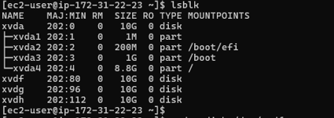
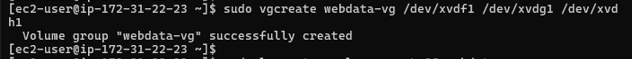
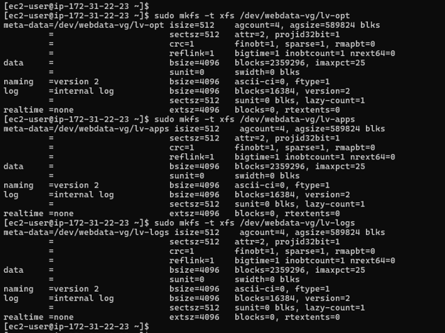
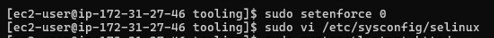

# DEVOPS TOOLING WEBSITE SOLUTION

In this project, we will implement a set o Devops tools that will help Devops team in day to day activities in managing, developing, testing, deploying and monitoring different projects. 

These tools are well known and widely used by multiple DevOps teams. This single DevOps Tooling Solution will consist of:

1 Jenkins - free and open source automation server used to build CI/CD pipelines.

2 Kubernetes - an open-source container-orchestration system for automating computer application deployment, scaling, and management.

3 Jfrog Artifactory - Universal Repository Manager supporting all major packaging formats, build tools and Cl servers. Artifactory.

4 Rancher - an open source software platform that enables organizations to run and manage Docker and Kubernetes in production.

5 Grafana - a multi-platform open source analytics and interactive visualization web application.

6 Prometheus - An open-source monitoring system with a dimensional data model, flexible query language, efficient time series database and modern alerting approach.

7 Kibana - Kibana is a free and open user interface that lets you visualize your Elasticsearch data and navigate the Elastic Stack.

### SETUP AND TECHNOLOGIES USED IN THE PROJECT

In this project, we will implement a solution that consists of the following components:

1. Infrastructure: AWS

2. Webserver Linux: Red Hat Enterprise Linux 8

3. Database Server: Ubuntu 20.04+ MySQL

4. Storage Server: Red Hat Enterprise Linux 8 + NFS Server

5. Programming Language: PHP

6. Code Repository: GitHub

The diagram above shows a common pattern where several stateless Web Servers share a common database and also access the same files using Network File Sytem (NFS) as a shared file storage. Even though the NFS server might be located on a completely separate hardware - For Web Servers it look like a local file system from where they can serve the same files.

### IMPLEMENTING A BUSINESS WEBSITE USING NFS FOR THE BACKEND FILE STORAGE

#### Step 1 - Prepare NFS Server

Spin up a new EC2 instance with RHEL Linux Operating System.

- To install the lvm2 package. Run `sudo yum install lvm2`

- To see all mount and free space on the web-server, run `df -h`

- Use lsdlk command to inspect what block devices are attached to the server

- To create a single partition on each of the disk using the gdisk utility, run `sudo gdisk /dev/xvdf` `sudo gdisk /dev/xvdh` `sudo gdisk /dev/xvdg`

- Run sudo `lvmdiskscan` to check for available partitions

- To mark each of the three disks as physical Volumes(Pvs) to be used by LVM, run the below commands

`sudo pvcreate /dev/xvdf1` 

`sudo pvcreate /dev/xvdg1` 

`sudo pvcreate /dev/xvdh1`

- To verify that the physical volume has been created successfully. Run `sudo pvs`

- To add all the three Physical volumes(pvs) to a Volume Group (VG). Name the VG webdata-vg

`sudo vgcreate webdata-vg /dev/xvdf1 /dev/xvdg1 /dev/xvdh1`

- To create 3-logic Volumes lv-opt, lv-apps and lv-logs, run the below commands;

`sudo lvcreate -n lv-apps -L 9G webdata-vg` 

`sudo lvcreate -n lv-logs -L 9G webdata-vg` 

`sudo lvcreate -n lv-opt -L 9G webdata-vg`

- To format the logical Volumes with xfs file system using mkfs.xfs

`sudo mkfs -t xfs /dev/webdata-vg/lv-opt`

`sudo mkfs -t xfs /dev/webdata-vg/lv-apps`

`sudo mkfs -t xfs /dev/webdata-vg/lv-logs`

- Create mount points on /mnt directory for the logical volumes as follow:

`sudo mkdir /mnt/apps`

`sudo mkdir /mnt/logs`

`sudo mkdir /mnt/opt`

Note that the 3 above mount points signifies the following;

`sudo mount /dev/webdata-vg/lv-apps /mnt/apps` - To be used by webservers

`sudo mount /dev/webdata-vg/lv-logs /mnt/logs` - To be used by webserver logs

`sudo mount /dev/webdata-vg/lv-opt /mnt/opt` - To be used by Jenkins server in Project 8

- Use rsync utility to backup all the files in the log directory /var/log into /mnt/logs (This is required before mounting the file system).

`sudo rsync -av /var/log/. /mnt/logs`

- To mount /var/log on logs-lv logical volume. (Note that all the existing data on /var/log will be deleted).

`sudo mount /dev/webdata-vg/lv-logs /var/log`

- To Restore log files back into /var/log directory.

`sudo rsync -av /mnt/logs/ /var/logs`

- To Update /etc/fstab file so that the mount configuration will persist after restarting the server. The UUID of the device will be used to update the /etc/fstab file. Run the command shown below to get the UUID of the lv-apps, lv-logs and lv-opt logical volumes: Run the below command

`sudo blkid`

apps: UUID=558fdf1e-0ccc-45e0-9c8b-15d5fd711192 /mnt/apps xfs defaults 0 0

opt: UUID=0ff66fdb-629b-48c0-baa4-6ce5dfb3feab /mnt/opt xfs defaults 0 0

logs: UUID=db40f263-1038-4f53-b2e5-f06d9a0574a1 /mnt/logs xfs defaults 0 0

Update /etc/fstab in this format using your own UUID and remember to remove the leading and ending quotes.

`sudo vi /etc/fstab`

- To Test the configuration, Run `sudo mount -a`

- To Reload the daemon , Run `sudo systemctl daemon-reload`

- To verify the set up, Run `sudo df -h` 

#### INSTALLING NFS-SERVER

- To install NFS server,configure it to start on reboot and make sure it is u and running.Start by running `sudo yum -y update`

Then run `sudo yum install nfs-utils -y`

`sudo systemctl start nfs-server.service`

`sudo systemctl enable nfs-server.service`

`sudo systemctl status nfs-server.service` 

- Export the mount for webserver `subnet cidr` to connect as clients. For simplicity, you will install the three webservers inside the subnet, but in production set up you would probably want to seperate each tier inside its own subnet for higher level of security.

- To check your `subnet cidr` - Open your EC2 details in AWS web console and locate Networking tab and open a subnet link.

To make sure we set up a permission that will allow our webservers read, write and execute files on NFS Server

`sudo chown -R nobody: /mnt/apps`

`sudo chown -R nobody: /mnt/logs`

`sudo chown -R nobody: /mnt/opt`

`sudo chmod -R 777 /mnt/apps`

`sudo chmod -R 777 /mnt/logs`

`sudo chmod -R 777 /mnt/opt`

`sudo systemctl restart nfs-server.service`

- Configure access to NFS for clients within the same subnet (example of subnet CIDR - 172.31.32.0/20)

`sudo vi /etc/exports`

Paste the below information

/mnt/apps <Subnet-CIDR>(rw,sync,no_all_squash,no_root_squash)

/mnt/logs <Subnet-CIDR>(rw,sync,no_all_squash,no_root_squash)

/mnt/opt <Subnet-CIDR>(rw,sync,no_all_squash,no_root_squash)

Esc + :wq!

- Next, to export, run `sudo exportfs -arv`

- To check which port is used by NFS server and open it using security groups, run the below command

`rpcinfo -p | grep nfs`

Important note: In order for NFS server to be accessible from your client, you must also open following ports; TCP 111, UDP 111, UDP 2049

### CONFIGURE BACKEND DATABASE AS PART OF 3 TIER ARCHITECTURE

#### Step 2 - Configure the database server

By now you should know how to install and configure a MySQL DBMS to work with remote Web Server

1. Install MySQL server
2. Create a database and name it tooling
3. Create a database user and name it webaccess
4. Grant permission to webaccess user on tooling database to do anything only from the webservers subnet cidr

- Start by running `sudo apt update -y` to update the server 

- Then run `sudo apt install mysql-server -y`

- Run the following code;

`sudo mysql`

`CREATE DATABASE tooling;`

`CREATE USER `myuser`@`<NFS-Server-Subnet CIDR-IP-Address>` 
IDENTIFIED BY 'mypass';`

`GRANT ALL ON tooling.* TO 'myuser'@'<NFS-Server-Subnet` 

`CIDR-IP-Address>';`

`FLUSH PRIVILEGES;`

`SHOW DATABASES;`

`exit`

- Check list of created users in MySQL Database, run `SELECT User, Host FROM mysql.user;`

- Change the `bind-address` and `mysqlx-bind-addresses` to 0.0.0.0

`sudo vi /etc/mysql/mysql.conf.d/mysqld.cnf`

- Default View

- Modified View

- Run `sudo systemctl restart mysql`

`sudo systemctl status mysql`

#### Step 3 - Prepare the Web Servers 

We need to make sure that our webservers can serve the same content from the shared storage solutions, in our case NFS server and MySql database. You already know that one DB can be accessed for reads and writes by multiple clients.For storing shared files that our webservers willuse- we utilize NFS and ount previously created logical Volume Lv-apps to the folder where Apache stores files to be served to the users (/var/www)

This approach will make our Webserver stateless, which means we will bw ablw to add new ones or remove them whenever we need, and the intergrity of the data(in the database and on NFS) will be preserved.

During the next steps, we will do the following;

- To configure NFS client(this step must be done on all three servers)

- Deploy a Tooling application to our web servers into a shared NFS Folder

- To configure the web-server to work with a single MySQL database.

Follow the below steps;

1. Launch a new EC2 instance with RHEL 8 Operating System and connect to terminal

2. Install NFS Client

`sudo yum install nfs-utils nfs4-acl-tools -y`

3. Mount /var/www/ and target the NFS server's export for apps

`sudo mkdir /var/www`

`sudo mount -t nfs -o rw,nosuid <NFS-Server-Private-IP-Address>:/mnt/apps /var/www`

`sudo df -h`

4. Verify that NFS was mounted successfully by running of df -h . Make sure that the changes will persist on Web Server after reboot:

`sudo vi /etc/fstab`

- Add following line

<NFS-Server-Private-IP-Address>:/mnt/apps /var/www nfs defaults 0 0

`172.31.22.23:/mnt/apps /var/www nfs defaults 0 0` (Please note that the colon after the IP Address is important)

5. Install Remi's repository, Apache and PHP

`sudo yum install httpd -y`

`sudo dnf install https://dl.fedoraproject.org/pub/epel/epel-release-latest-8.noarch.rpm`

`sudo dnf install dnf-utils http://rpms.remirepo.net/enterprise/remi-release-8.rpm`

`sudo dnf module reset php`

`sudo dnf module enable php:remi-7.4`

`sudo dnf install php php-opcache php-gd php-curl php-mysqlnd`

`sudo systemctl start php-fpm`

`sudo systemctl enable php-fpm`

`sudo setsebool -P httpd_execmem 1`

#### Repeat Step 1-5 for another 2 Web Servers

6. Verify that Apache files and directories are available on the Web Server in /var/www and also on the NFS server in /mnt/apps.

If you see the same files - it means NFS is mounted correctly. You can try to create a new file touch test.txt from one server and check if the same file is accessible from other Web Servers.

Created a file called touch.md in Web 1 by navigating to cd /var/www

The same file could be seen in my NFS Server by navigating to cd /mnt/apps

7. Locate the log folder for Apache on the Web Server 1 and mount it to NFS server's export for logs.

Repeat Step Number 4 to make sure the mount point will persist after reboot.

On the Web 1 Server, run `sudo mount -t nfs -o rw,nosuid 172.31.22.23:/mnt/logs /var/log/httpd`

Run `sudo vi /etc/fstab` to Vi into the Web 1 server and update the file using the below parameters:

`172.31.22.23:/mnt/logs /var/log/httpd nfs defaults 0 0`

8. Fork the tooling source code from Darey.io Github Account to your Github account.

`sudo yum install git`

git clone https://github.com/darey-io/tooling.git

9. Deploy the tooling website's code to the Webserver. Ensure that the html folder from the repository is deployed to /var/www/html

`cd tooling`

`sudo cp -R html/. /var/www/html`

`ls /var/www/html`

`ls html/`

Note: Do not forget to open TCP port 80 on the Web Server.

Also Note: If you encounter 403 Error-check permissions to your /var/www/html folder and also disable SELinux sudo setenforce ®

To make this change permanent - open following config file

`sudo setenforce 0`

`sudo vi /etc/sysconfig/selinux`

And set

`SELINUX-disabled`

Default view

Modified view 

Then restart httpd

`sudo systemctl start httpd`

`sudo systemctl status httpd`

Change binding address to 0.0.0.0 on MySQL Server

`sudo vi /etc/mysql/mysql.conf.d/mysqld.cnf`

10. Update the website's configuration to connect to the database (in /var/www/html/functions.php file).

`sudo vi /var/www/html/functions.php`

Default View

Change to 

$db = mysqli_connect('172.31.27.143', 'webaccess', 'password10', 'tooling')

- On the MySQL Web Server, allow the MySQL/Aurora inbound IP in the inbound rule. Use the custom subnet CIDR IP address linked to your NFS Server and apply it to the customer IP in MySQL inbound rule.

- Go to Edit Inbound rules, pick type to be MYSQL/AURORA, port range should be 3306 and the subnet cidr should be added also

Save and exit

-On your Web Server, apply tooling-db.sql script to your database using this command mysql -h -u -p < tooling-db.sql

`sudo yum install mysql`

- On my Web Server, Cd into the tooling directory. The below command is trying to inform us that the file has now been sent as expected.

`cd tooling`

`mysql -h <databse-private-ip> -u <db-username> -p<db-pasword> < tooling-db.sql`

11. Create in MySQL a new admin user with username: myuser and password: password:

INSERT INTO 'users' ('id', 'username', 'password', 'email', 'user_type', 'status') VALUES
-> (1, 'myuser', '5f4dcc3b5aa765d61d8327deb882cf99', 'user@mail.com', 'admin', '1');

12. Open the website in your browser

`http://<Web-Server-Public-IP-Address-or-Public-DNS-Name>/index.php`

`http://54.188.15.10/`

# END OF PROJECT 10

