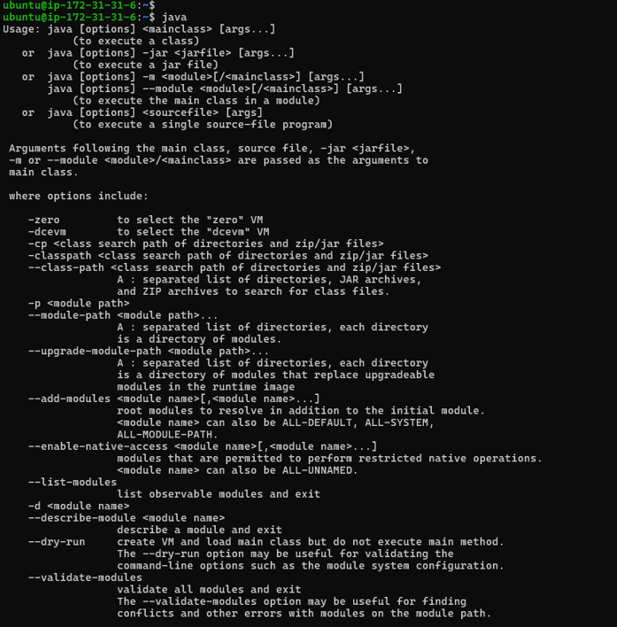
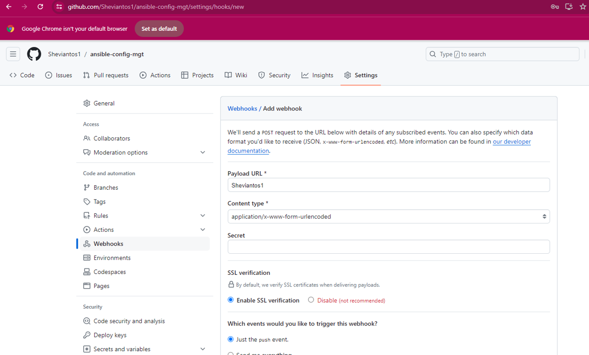
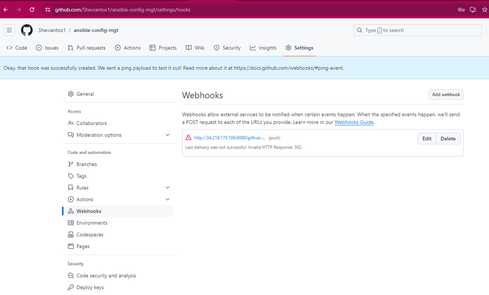

# ANSIBLE CONFIGURATION MANAGEMENT

What is Ansible and why use It?

Ansible is an open-source automation tool that allows users to automate the process of configuring and managing computer systems. It simplifies tasks such as application deployment, configuration management, and workflow automation.

There are several reasons to use Ansible:

1. Simplicity: Ansible uses simple, human-readable YAML scripts for configuration, making it easy to learn and use.
2. Agentless: Ansible operates over SSH, requiring no agent to be installed on the remote systems, making it lightweight and easy to manage.
3. Idempotent: Ansible plays configurations repeatedly without changing the system state if the desired configuration already exists, ensuring consistency.
4. Scalability: Ansible can manage thousands of systems in parallel, making it suitable for both small and large infrastructures.
5. Extensibility: Ansible allows users to create their modules and plugins to extend its functionality.
6. Integration: Ansible integrates with various cloud platforms, networking devices, and external tools for seamless automation across different environments.


This project aims to enhance your appreciation for DevOps tools by automating routine tasks through Ansible Configuration Management. Additionally, it will boost your confidence in writing code using declarative languages like YAML.

#### Ansible Client as a Jump Server (Bastion Host)

A Jump Server (sometimes also referred as Bastion Host) is an intermediary server through which access to internal network can be provided. If you think about the current architecture you are working on, ideally, the webservers would be inside a secured network which cannot be reached directly from the Internet. That means, even DevOps engineers cannot SSH into the Web servers directly and can only access it through a Jump Server – it provide better security and reduces attack surface.


We will be performing the following tasks:

- Install and configure Ansible client to act as a Jump Server/Bastion Host.
- Create a simple Ansible playbook to automate servers configuration.

### INSTALL AND CONFIGURE ANSIBLE ON EC2 INSTANCE

Step 1 - Install and Configure Ansible on EC2 Instance

1. Update the `Name` tag on your `Jenkins` EC2 Instance to `Jenkins-Ansible`. We will use this server to run playbooks.

Create an ec2 instance with the name Jenkins-Ansible and connect it to the terminal


2. In your Github account create a new repository and name it `ansible-config-mgt`.


3. Connect the Jenkins-Ansible to terminal and Install Ansible by running;

`sudo apt update`


`sudo apt install ansible`


- Check your Ansible version by running `ansible --version`


- In order to access ansible through the web browser, go to your EC2 instance inbound rule and open TCP port 8080, IPV4 anywhere


- It's crucial to understand that Jenkins requires Java to be installed before it can function properly. Therefore, installing Java is a necessary step before using Jenkins.

`sudo apt install openjdk-17-jre-headless`


- To check whether Java is installed, run `java`;



- To install Jenkins, run the below commands; REF: https://www.jenkins.io/doc/book/installing/linux/#debianubuntu

`sudo wget -O /usr/share/keyrings/jenkins-keyring.asc \
  https://pkg.jenkins.io/debian-stable/jenkins.io-2023.key`

  

`echo "deb [signed-by=/usr/share/keyrings/jenkins-keyring.asc]" \
  https://pkg.jenkins.io/debian-stable binary/ | sudo tee \
  /etc/apt/sources.list.d/jenkins.list > /dev/null`


`sudo apt-get update`


`sudo apt-get install jenkins`


`sudo systemctl status jenkins`


- Now run the public IP address of Jenkins-Ansible on your browser to Unlock Jenkins


- To setup an administrative password for my jenkins, run `sudo cat /var/lib/jenkins/secrets/initialAdminPassword`


- Copy the administrative password generated and paste it on your Jenkins page then click continue


- Then it loads the page to customize Jenkins, click to install suggested plugins


- Fill the Page to create first Admin User


- Then configure your Jenkins Instance and start using Jenkins after it 


- Then it loads Jenkins Dashboard


4. Configure Jenkins build job to save your repository content every time you change it – this will solidify your Jenkins configuration skills acquired in previous Jenkins project.

- Log into Jenkins by typing on your browser `http://public_ip_jenkins_ansible_instance:8080`

- Create a new Freestyle project ansible in Jenkins and point it to your ‘ansible-config-mgt’ repository.

Click on the caption "New Item" as shown in the below screenshot


Click on the caption "Freestyle project"


Ansible Build is successful now


- Configure Webhook in GitHub and set webhook to trigger ansible build.






- Enable Proxy Compatibility in Jenkins Security features


- Configure a Post-build job to save all (**) files, like it was done in Project 9.


5. Test your setup by making some change in README.MD file in master branch and make sure that builds starts automatically and Jenkins saves the files (build artifacts) in following folder

`ls /var/lib/jenkins/jobs/ansible/builds/<build_number>/archive/`


Note: Trigger Jenkins project execution only for /main (main) branch.

Now your setup will look like this:


Tip: Every time you stop/start your Jenkins-Ansible server – you have to reconfigure GitHub webhook to a new IP address, in order to avoid it, it makes sense to allocate an Elastic IP to your Jenkins-Ansible server (you have done it before to your LB server in Project 10). Note that Elastic IP is free only when it is being allocated to an EC2 Instance, so do not forget to release Elastic IP once you terminate your EC2 Instance.

### Step 4: Prepare your development environment using Visual Studio Code

- Download and install VS Code

- After successfully installing VS Code, configure it to connect to your newly created GitHub repository.

- Clone down the ansible-config-mgt repository to your local machine.

- Run `git clone <ansible-config-mgt-repository-link>`


## BEGIN ANSIBLE DEVELOPMENT

### Step 5 - Begin Ansible Development

1. In your ansible-config-mgt GitHub repository, create a new branch that will be used for development of a new feature.

Tip: Give your branches descriptive and comprehensive names, for example, if you use Jira or Trello as a project management tool – include ticket number (e.g. PRJ-145) in the name of your branch and add a topic and a brief description what this branch is about – a bugfix, hotfix, feature, release (e.g. feature/prj-145-lvm)

2. Checkout the newly created feature branch to your local machine and start building your code and directory structure

3. Create a directory and name it playbooks – it will be used to store all your playbook files.

4. Create a directory and name it inventory – it will be used to keep your hosts organised.

5. Within the playbooks folder, create your first playbook, and name it common.yml

6. Within the inventory folder, create an inventory file (.yml) for each environment (Development, Staging Testing and Production) dev, staging, uat, and prod respectively.


### Step 6 – Set up an Ansible Inventory

An Ansible inventory file defines the hosts and groups of hosts upon which commands, modules, and tasks in a playbook operate. Since our intention is to execute Linux commands on remote hosts, and ensure that it is the intended configuration on a particular server that occurs. It is important to have a way to organize our hosts in such an Inventory.

Save below inventory structure in the inventory/dev file to start configuring your development servers. Ensure to replace the IP addresses according to your own setup.

Note: Ansible uses TCP port 22 by default, which means it needs to ssh into target servers from Jenkins-Ansible host – for this you can implement the concept of ssh-agent. Now you need to import your key into ssh-agent:

`eval ``ssh-agent -s`

`ssh-add <path-to-private-key>`

Confirm the key has been added with the command below, you should see the name of your key

`ssh-add -l`

Now, ssh into your `Jenkins-Ansible` server using ssh-agent

`ssh -A ubuntu@public-ip`

Also note, that your Load Balancer user is ubuntu and user for RHEL-based servers is ec2-user.


Update your `inventory/dev.yml` file with this snippet of code:

```
[nfs]
<NFS-Server-Private-IP-Address> ansible_ssh_user='ec2-user'

[webservers]
<Web-Server1-Private-IP-Address> ansible_ssh_user='ec2-user'
<Web-Server2-Private-IP-Address> ansible_ssh_user='ec2-user'

[db]
<Database-Private-IP-Address> ansible_ssh_user='ec2-user' 

[lb]
<Load-Balancer-Private-IP-Address> ansible_ssh_user='ubuntu'

```


## CREATE A COMMON PLAYBOOK

### Step 7 – Create a Common Playbook
It is time to start giving Ansible the instructions on what you needs to be performed on all servers listed in `inventory/dev`.

In `common.yml` playbook you will write configuration for repeatable, re-usable, and multi-machine tasks that is common to systems within the infrastructure.

Update your `playbooks/common.yml` file with following code

```

- name: update web, nfs and db servers
  hosts: webservers, nfs
  remote_user: ec2-user
  become: yes
  become_user: root
  tasks:
    - name: ensure wireshark is at the latest version
      yum:
        name: wireshark
        state: latest

- name: update LB server
  hosts: lb, db
  remote_user: ubuntu
  become: yes
  become_user: root
  tasks:
    - name: Update apt repo
      apt: 
        update_cache: yes

    - name: ensure wireshark is at the latest version
      apt:
        name: wireshark
        state: latest

```


The code provided is split into two sections, each aiming to achieve the same goal: installing or updating the Wireshark utility on RHEL 8 and Ubuntu servers. It utilizes the root user for performing these tasks and the appropriate package managers, yum for RHEL 8 and apt for Ubuntu.

### Step 8 – Update GIT with the latest code

Push all the changes made to the directories and files from local machine to Github.

Commit your code into GitHub:

1. Use git commands to add, commit and push your branch to GitHub.

```
git status

git add <selected files>

git commit -m "commit message"
```


2. Create a Pull request (PR)

3. Wear a hat of another developer for a second, and act as a reviewer.

4. If the reviewer is happy with your new feature development, merge the code to the master branch.

5. Head back on your terminal, checkout from the feature branch into the master, and pull down the latest changes.

Once the code changes appear in master branch – Jenkins will do its job and save all the files (build artifacts) to `/var/lib/jenkins/jobs/ansible/builds/<build_number>/archive/` directory on `Jenkins-Ansible` server as shown below.

## RUN FIRST ANSIBLE TEST

### Step 9 - Run first Ansible test

Now, it is time to execute ansible-playbook command and verify if your playbook actually works:

Connect to your jenkins-ansible server via VScode (configure the .ssh/config file with your jenkins server information)

```
ansible-playbook -i /var/lib/jenkins/jobs/ansible/builds/<build-number>/archive/inventory/dev.yml /var/lib/jenkins/jobs/ansible/builds/<build-number>/archive/playbooks/common.yml
```


You can go to each of the servers and check if `wireshark` has been installed by running `which wireshark` or `wireshark --version`


At the end of this project we have implemented a solution that is shown below

## END OF PROJECT 11


