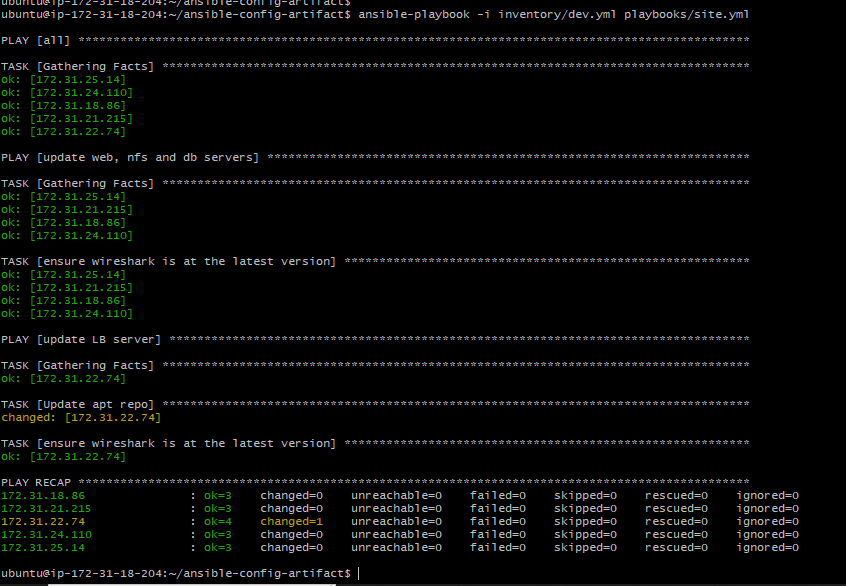

# ANSIBLE REFACTORING AND STATIC ASSIGNMENTS (IMPORTS AND ROLES)

In this project, we will be refactoring the Ansible code, creating assignments, and utilizing the imports functionality. Imports enable the efficient reuse of existing playbooks within a new playbook, aiding in task organization and reusability. We will be further enhancing the code in the "ansible-config-mgt" repository on My Github.

#### Code Refactoring

Refactoring is a broad concept in computer programming that involves altering the source code without impacting the expected behavior of the software. The primary goal of refactoring is to improve code readability, enhance maintainability and extensibility, reduce complexity, and incorporate appropriate comments while keeping the logic intact.

### Cloud Infracture for the Project
- Cloud Platform: AWS

- OS: 5 Red Hat Enterprise Linux 8; 3 Ubuntu 20.04

#### Server Applications:

- Webserver (Red Hat Enterprise Linux 8): 2 Apache2

- Load balancer Server (Ubuntu 20.04): NGINX load balancer

- Database server (Ubuntu 20.04): MYSQL

- Storage Server (Red Hat Enterprise Linux 8): NFS server

- CI/CD Server (Ubuntu 20.04): Jenkins-Ansible

- UAT Webserver (Red Hat Enterprise Linux 8):

### Step 1 - Jenkins Job Enhancement

Before we begin, let us make some changes to our Jenkins job – now every new change in the codes creates a separate directory which is not very convenient when we want to run some commands from one place. Besides, it consumes space on Jenkins serves with each subsequent change. Let us enhance it by introducing a new Jenkins project/job – we will require Copy Artifact plugin.

Go to your Jenkins-Ansible server and create a new directory called ansible-config-artifact – we will store there all artifacts after each build.

`sudo mkdir /home/ubuntu/ansible-config-artifact`


2. Change permissions to this directory, so Jenkins could save files there – `chmod -R 0777 /home/ubuntu/ansible-config-artifact`


3. Go to Jenkins web console -> Manage Jenkins -> Manage Plugins -> on Available tab search for Copy Artifact and install this plugin without restarting Jenkins


4. Create a new Freestyle project (you have done it in the last project) and name it save_artifacts.


5. This project will be triggered by completion of your existing ansible project. Configure it accordingly:


Note: You can configure number of builds to keep in order to save space on the server, for example, you might want to keep only last 2 or 5 build results. You can also make this change to your ansible job.

6. The primary objective of the save_artifacts project is to store artifacts in the directory `/home/ubuntu/ansible-config-artifact.` To accomplish this, set up a `Build` step and select `Copy artifacts from another project.` Specify "ansible" as the source project and `/home/ubuntu/ansible-config-artifact` as the destination directory.


7. Test your set up by making some change in README.MD file inside your `ansible-config-mgt` repository (right inside master branch).

If both Jenkins jobs have completed one after another – you shall see your files inside `/home/ubuntu/ansible-config-artifact` directory and it will be updated with every commit to your master branch.

NOTE: For a successful build of save-artifact, you must change both the ownership and permission of ansible-config-artifact to ubuntu and 777 respectively, change ubuntu permission to 777


NOTE: After the successful build, the permission was reverted to 775 to enable Ubuntu to allow SSH access after logging out.

Now your Jenkins pipeline is more neat and clean.

### REFACTOR ANSIBLE CODE BY IMPORTING OTHER PLAYBOOKS INTO SITE.YML

Before starting to refactor any codes, ensure that you have pulled down the latest code from master (main) branch, and created a new branch, name it refactor.

1. Within `playbooks` folder, create a new file and name it `site.yml` – This file will now be considered as an entry point into the entire infrastructure configuration. Other playbooks will be included here as a reference. In other words, `site.yml` will become a parent to all other playbooks that will be developed. Including `common.yml` that you created previously.


2. Create a new folder in root of the repository and name it `static-assignments`. The **static-assignments** folder is where all other children playbooks will be stored. This is merely for easy organization of your work. It is not an Ansible specific concept, therefore you can choose how you want to organize your work. You will see why the folder name has a prefix of static very soon. For now, just follow along.

3. Move `common.yml` file into the newly created `static-assignments` folder.

4. Inside `site.yml` file, import `common.yml` playbook.

```
---
- hosts: all
- import_playbook: ../static-assignments/common.yml
```

The code above uses built in import_playbook Ansible module.

The folder structure looks like this;

```
├── static-assignments
│   └── common.yml
├── inventory
    └── dev
    └── stage
    └── uat
    └── prod
└── playbooks
    └── site.yml
```


5. Since i need to apply some tasks to your `dev` servers and `wireshark` is already installed – i can go ahead and create another playbook under `static-assignments` and name it `common-del.yml`. In this playbook, configure deletion of wireshark utility.

```
---
- name: update web and nfs servers
  hosts: webservers and nfs
  remote_user: ec2-user
  become: yes
  become_user: root
  tasks:
  - name: delete wireshark
    yum:
      name: wireshark
      state: removed

- name: update LB and DB servers
  hosts: lb, db 
  remote_user: ubuntu
  become: yes
  become_user: root
  tasks:
  - name: delete wireshark
    apt:
      name: wireshark-qt
      state: absent
      autoremove: yes
      purge: yes
      autoclean: yes
```


update site.yml with - import_playbook: ../static-assignments/common-del.yml instead of common.yml and run it against dev servers: 


```
cd /home/ubuntu/ansible-config-mgt/

ansible-playbook -i inventory/dev.yml playbooks/site.yml
```



Make sure that wireshark is deleted on all the servers by running wireshark --version


### CONFIGURE UAT WEBSERVERS WITH A ROLE ‘WEBSERVER’

#### Step 3 – Configure UAT Webservers with a role ‘Webserver’

1. Launch 2 fresh EC2 instances using RHEL 8 image, we will use them as our uat servers, so give them names accordingly – Web1-UAT and Web2-UAT.


2. To create a role, you must create a directory called roles/, relative to the playbook file or in /etc/ansible/ directory.
- Create the directory/files structure manually


3. Update your inventory ansible-config-mgt/inventory/uat.yml file with IP addresses of your 2 UAT Web servers
```
[uat-webservers]
<Web1-UAT-Server-Private-IP-Address> ansible_ssh_user='ec2-user' 

<Web2-UAT-Server-Private-IP-Address> ansible_ssh_user='ec2-user' 
```


4. In `/etc/ansible/ansible.cfg` file uncomment `roles_path` string and provide a full path to your roles directory `roles_path    = /home/ubuntu/ansible-config-mgt/roles`, so Ansible could know where to find configured roles.


5. It is time to start adding some logic to the webserver role. Go into `tasks` directory, and within the `main.yml` file, start writing configuration tasks to do the following:

- Install and configure Apache (`httpd` service)
- Clone Tooling website from GitHub `https://github.com/<your-name>/tooling.git`.
- Ensure the tooling website code is deployed to `/var/www/html` on each of 2 UAT Web servers.
- Make sure `httpd` service is started

Your `main.yml` may consist of following tasks:

```
- name: Install apache
  become: true
  ansible.builtin.yum:
    name: "httpd"
    state: present

- name: Install git
  become: true
  ansible.builtin.yum:
    name: "git"
    state: present

- name: clone a repo
  become: true
  ansible.builtin.git:
    repo: https://github.com/Sheviantos1/tooling.git
    dest: /var/www/html
    force: yes

- name: copy html content to one level up
  become: true
  command: cp -r /var/www/html /var/www/

- name: Start service httpd, if not started
  become: true
  ansible.builtin.service:
    name: httpd
    state: started

- name: recursively remove /var/www/html directory
  become: true
  ansible.builtin.file:
  path: /var/www/html
  state: absent
```


### REFERENCE WEBSERVER ROLE

#### Step 4 - Reference 'Webserver' role

Within the `static-assignments` folder, create a new assignment for **uat-webservers** `uat-webservers.yml`. This is where you will reference the role.

```
- hosts: uat-webservers
  roles:
     - webserver
```


Remember that the entry point to our ansible configuration is the `site.yml` file. Therefore, you need to refer your `uat-webservers.yml` role inside `site.yml`.

So, we should have this in `site.yml`

```
---
- hosts: all
- import_playbook: ../static-assignments/common.yml

- hosts: uat-webservers
- import_playbook: ../static-assignments/uat-webservers.yml
```


#### Step 5 – Commit & Test

Commit your changes, create a Pull Request and merge them to `master` branch, make sure webhook triggered two consequent Jenkins jobs, they ran successfully and copied all the files to your `Jenkins-Ansible` server into `/home/ubuntu/ansible-config-mgt/` directory.

Now run the playbook against your `uat` inventory and see what happens:

**NOTE:** Before running your playbook, ensure you have tunneled into your `Jenkins-Ansible` server via ssh-agent. 

```
cd /home/ubuntu/ansible-config-mgt (mine is ansible )

ansible-playbook -i /inventory/uat.yml playbooks/site.yaml
```


NOTE: For the playbook to actually run successful, there are some things that I put in place 

1. My Ansible does not have /etc/ansible/ansible.cfg so I had to create one 


2. Edit the ansible.cfg to have the following command


3. Then tasks/main file contains cloning github tooling so I forked Darey.io tooling folder to that contain the propitix web page 


You should be able to see both of your UAT Web servers configured and you can try to reach them from your browser:

```
http://<Web1-UAT-Server-Public-IP-or-Public-DNS-Name>/index.php

or

http://<Web2-UAT-Server-Public-IP-or-Public-DNS-Name>/index.php
```


Web2 UAT Server page below


Your Ansible architecture now looks like this:


## CONGRATULATIONS


