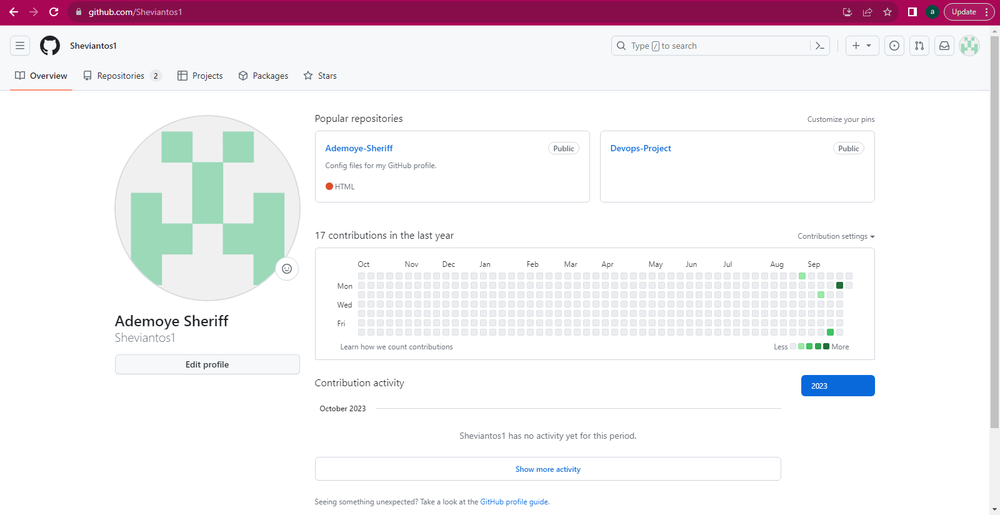
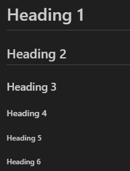
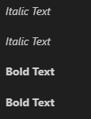
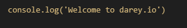

# **GIT PROJECT**

## **Prerequisite**

- Basic Understanding of Version Control

- Install Git

- Create a GitHub Account

- Basic Command Line Knowledge

## **What is GIT**

Git is a widely used distributed version control system (DVCS) designed to track changes in software code during software development. It allows multiple developers to collaborate on a project efficiently, managing and merging changes to the source code. Git was created by Linus Torvalds, the same individual who developed the Linux operating system.

Git is a powerful tool that can be used to manage any type of project, but it is especially well-suited for software development. Git is free, open-source, and widely used, making it a great choice for projects of all sizes.

## **Initializing a Git Repository**

To initialize a `Git` repository, you can use the `git init` command. This command will create a new `.git` directory in the current working directory. The `.git` directory contains all of the metadata that Git uses to track changes to your code.

To initialize a Git repository, follow these steps:

- Create a New Project Directory: Start by creating a new directory for your project. This is where all your project files will be stored. 

For example, create Devops folder using this command `mkdir Devops`

- Navigate to the Project Directory: Move into the newly created project directory using the `cd` command.

For example, you can change into the newly created Devops Directory using this command `cd Devops`

- Initialize a Git Repository: Use the `git init` command to initialize a new Git repository in the project directory.

## **Making the First Commit**

To commit in Git means to save a snapshot of the current state of your repository to its history. Commits are the fundamental building blocks of Git. They allow you to track changes to your code over time, and to collaborate with other developers on the same project.

- Create a New File using `touch`: Use the `touch` command to create a new file. For example, to create a file named `index.txt`, you would run: `touch index.txt` command

- Use `echo` to Add Text to the File: Use the `echo` command to add some content to the file. For example: `echo "Welcome to a new dispensation" > index.txt`

- Verify the File Contents: Use `cat` command to verify the contents of the file. Foe example, use the `cat index.txt` to check the content of `index.txt` file.

- Check the Status: Use the `git status` command to see the current status of your repository. It will show the untracked file (index.txt) in red.

- Stage the File: Use the `git add` command to stage the new file for the commit. You can use the `git add index.txt` to stage the `index.txt` file

- Check the Status: Use the `git status` command to see the current status of your repository. It will show the tracked file (index.txt) in green.

- Commit the Changes: Use the `git commit` command to create a new commit with the staged changes. For example, git commit -m "initial commit" to ccommit the new tracked files

- View Commit History: Optionally, you can use git log to view the commit history and confirm that your commit was made successfully.

## **Working with Branches**

Branches are a powerful tool for managing changes in Git. By using branches, you can isolate changes from the main codebase, work on multiple features simultaneously, and easily merge changes back into the main codebase. Git branches enable isolation of work, easy merging of changes, and experimentation without affecting the main codebase. The git branch command is used to create, list, rename, and delete branches in Git.

## Making the First Branch

Follow this steps to create your git branch

- Create a New Branch: To create a new branch, use the git branch command followed by the branch name. `git branch master`

- Switch to the New Branch: To switch to the newly created branch, use the git checkout command. `git checkout master`

- Alternatively, you can combine branch creation and switching using -b. `git checkout -b best`

## Listing Our Git Branches

To list Git branches, you can use the git branch command. This command will list all of the local branches in your repository, as well as any remote branches that you are tracking.

To list all of the branches in your repository, run the following command: `git branch`

To list only the remote branches that you are tracking, run the following command: `git branch -r`

## Change into an Old Branch

To change into an old branch in Git, you can use the git checkout command. This command will switch to the specified branch. 

To switch to an existing branch with name master, run the following command: `git checkout master`

## Merging a Branch into another Branch

To merge a branch into another branch in Git, you can use the git merge command. This command will combine the changes from the two branches into a single branch.

To merge a branch into another branch, run the following command: `git merge <branch-name>`

In the above image, the `git merge` command was used the merge the `master` branch with the `main` branch 

## Deleting a git branch

To delete a Git branch, you can use the git branch -d command. This command will delete the specified branch, but it will not delete the changes that have been made to the branch.

To delete a branch, run the following command: `git branch -d <branch-name>`

In the above image, the `git branch -d` command was used to delete the `master` branch since we have merge it with the `main` branch, we do not need it anymore

## **Collaboration and Remote Repositories**

Git is a powerful tool for software development, thanks in part to its two key features: collaboration and remote repositories.

Remote repositories allow you to store your code on a server, such as GitHub or GitLab. This makes it easy to share your code with others and to collaborate on projects.

Collaboration in Git is made possible by the ability to push and pull changes to and from a remote repository. This allows team members to work on the same codebase simultaneously and to easily merge their changes together.

To collaborate on a project using Git, you and your team members need to clone the same remote repository to your local machines. Once you have cloned the repository, you can make changes to the code and commit them to your local branch. Once you are finished with your changes, you can push your changes to the remote repository.

When you push your changes to the remote repository, other team members can pull your changes to their local machines. This allows everyone to stay up-to-date with the latest changes to the code.

## Creating a Github Account

To create a GitHub account, follow these steps:

- Go to the [Github](https://www.github.com) website and click the Sign up button.
- Enter your email address, username, and password.
- Select your plan. GitHub offers a free plan for individuals and open source projects, as well as paid plans for teams and businesses.
- Click the Create an account button.
- Verify your email address.
- Complete your profile.
- Once you have created your account, you can start using GitHub to store, manage, and collaborate on your code.

The overview of our github account should be like the below image

## Creating your First Repository

- Access the New Repository Page: Click on the "+" icon in the top right corner and select "New repository" from the dropdown menu.

- Fill in Repository Details:

1. Repository Name: Enter a name for your repository (e.g., "my-first-repo"). This should be descriptive and relevant to your project.
2. Description (Optional): Provide a brief description of your repository to help others understand its purpose.
3. Public or Private: Choose whether you want your repository to be public (visible to everyone) or private (accessible only to you and collaborators).
4. Initialize with a README file: Check this option if you want to create an initial README file, which is often used to provide project information and instructions.

- Choose a License (Optional): Optionally, you can add an open-source license to your repository. This is a good practice if you plan to share your code with others. Choose a license that suits your project.

- Click "Create Repository": Once you've filled in the details, click the "Create repository" button.

- Congratulations! Your Repository is Created: You have successfully created your first GitHub repository. You can now add code, documentation, and collaborate with others on your project.

## Pushing your Local Git Repository to Remote Github Repository

To push your local Git repository to a remote GitHub repository, follow these steps:

- Check Remote Repository (Optional): Use git `remote -v` to check if your local repository is already connected to a remote repository. If you don't see any remote repository listed, you'll need to add one.

- Link Your Local Repository to the GitHub Repository: If your local repository isn't already linked to the GitHub repository, use `git remote add` to add a remote connection.

`git remote add origin <github_repository_url>`

- Stage and Commit Your Changes: Use `git add` to stage the changes you want to push and `git commit` to create a commit.

- Push Changes to the Remote Repository: Use `git push` to push your local commits to the GitHub repository.

## Cloning Remote Git Repository

To clone the gitproject repository from GitHub, you would run the following command: `git clone https://github.com/Sheviantos1/Ademoye-Sheriff.git`

## **Branch Management and Tagging**

## Introduction to Markdown Syntax

Markdown serves as a lightweight markup language utilized to format text using a simple, plain-text syntax. It finds extensive application in a multitude of settings, including README files, documentation, online forums, and similar platforms. Markdown offers a straightforward approach to organize and stylize text, eliminating the need for intricate HTML or other complex formatting languages. To create a Markdown document, simply start typing your text in a plain text editor. You can use the following Markdown syntax to format your text:

### Headings: 

Use # to denote headings, with one # for the largest heading and up to six # for the smallest heading:

`# Heading 1`

`## Heading 2`

`### Heading 3`

`#### Heading 4`

`##### Heading 5`

`###### Heading 6`

### Lists

Unordered List:

Use *, -, or + to create an unordered list:

`* Item 1`

`* Item 2`

`* Item 3`

Ordered List:

Use numbers followed by a dot to create an ordered list:

`1. Item 1`

`2. Item 2`

`3. Item 3`

- Emphasis: To italicize text, enclose it in asterisks (*) or underscores (_). To bold text, enclose it in double asterisks (**) or double underscores (__).

`*Italic Text*`

`_Italic Text_`

`**Bold Text**`

`__Bold Text__`

- Links: To create a link, enclose the link text in square brackets ([]), and then follow it with the link URL in parentheses ().

Example: `[Visit Darey.io](https://www.darey.io)` 

- Images: To insert an image, use the following syntax: ``

For Example: `` will give the below image

- Code: Enclose text in backticks (`)

`console.log('Welcome to darey.io')`

