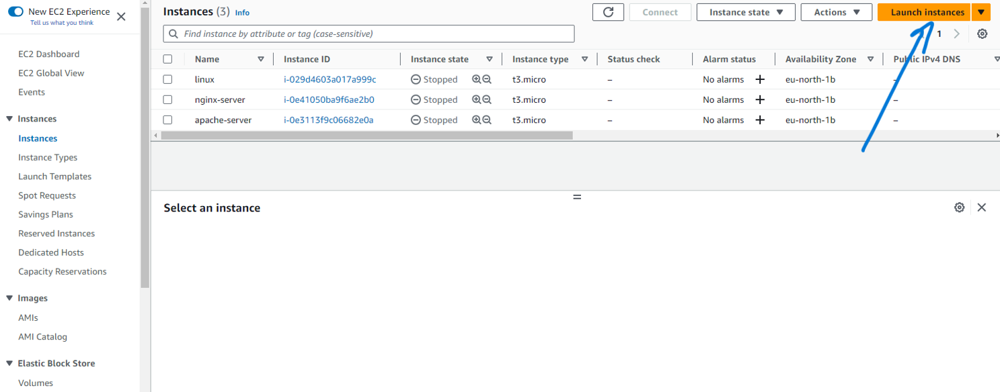
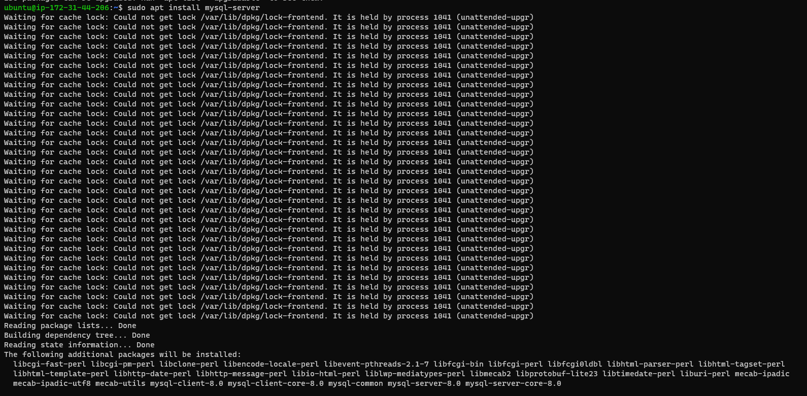
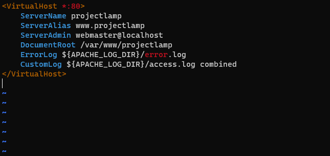

# **LAMPSTACK IMPLEMENTATION PROJECT**

## What is Lampstack?

LAMP stack is a popular open-source software stack used to build and deploy web applications. LAMP stands for Linux, Apache, MySQL, and PHP.

- Linux is the operating system that provides the foundation for the LAMP stack. It is known for its stability, security, and scalability.
- Apache is a web server that delivers web pages to users' browsers. It is one of the most popular web servers in the world and is known for its performance and reliability.
- MySQL is a relational database management system (RDBMS) that stores and manages data for web applications. It is known for its speed, scalability, and ease of use.
- PHP is a scripting language that is used to create dynamic web pages. It is easy to learn and use, and it is integrated with MySQL to make it easy to access and manipulate data.

Together, these components form a powerful and widely-used environment for developing and hosting web applications. Developers use Linux as the operating system, Apache for handling web requests, MySQL for managing the database, and PHP (or similar languages) for processing server-side scripts and generating dynamic web content. The LAMP stack is known for its stability, performance, and cost-effectiveness, making it a popular choice for building various types of web applications.

## What is a Stack?

The word "stack" in LAMP stack refers to a collection of software technologies that are used together to build and run dynamic websites and web applications. LAMP is an acronym for Linux, Apache, MySQL, and PHP.

## Prerequisites for LAMPSTACK Implementation

- AWS Account
- A virtual server
- Ubuntu Server with OS

## AWS account setup and provisioning to Ubuntu Server

Setting up an Ubuntu server on AWS involves creating an AWS account, launching an EC2 (Elastic Compute Cloud) instance, and configuring it with Ubuntu. Here's a step-by-step guide to help you with the process:

1. Create an AWS Account:
If you don't have an AWS account, go to the [AWS website](https://aws.amazon.com/) and create a new account. Follow the on-screen instructions to complete the signup process.

2. Access AWS Management Console:
Log in to the [AWS Management Console](https://aws.amazon.com/console/).

3. Launch an EC2 Instance (Ubuntu Server):
Click on the "Services" dropdown in the top left corner and select "EC2" under the "Compute" section.

Click "Launch Instance" to create a new EC2 instance.

In the "Choose an Amazon Machine Image (AMI)" step, select an Ubuntu Server image (e.g., Ubuntu Server 20.04 LTS).

Follow the steps in the EC2 instance creation wizard, including configuring the instance type, adding storage, configuring security groups, and reviewing the details.

In the "Configure Security Group" step, make sure to add a rule to allow SSH access (port 22) for secure server administration. You can also add rules for HTTP (port 80) and HTTPS (port 443) if needed.

Click "Review and Launch," then click "Launch."

A pop-up will prompt you to select or create a new key pair. Create a new key pair and download the private key file (*.pem). Keep this file in a secure location as you'll need it to SSH into the server.

Instance has been created and confirm the status is Running. You can also stop or start the instance based on your preference

4. Connect to the Ubuntu Server via SSH:
- Open a terminal (on Windows, you can use an SSH client like PuTTY).
- Set appropriate permissions to the private key file: `chmod 400 path/to/your-key.pem`

- Connect to the server using SSH, replacing your-instance-public-ip with the actual public IP of your EC2 instance: `ssh -i path/to/your-key.pem ubuntu@your-instance-public-ip`

To connect to the instance from the terminal, run the ssh command in the directory where you saved the private key. The private key is the file that you created when you launched the instance. It is used to authenticate you to the instance when you try to connect to it using SSH.

## **Installing Apache and Updating Firewalls**

Apache is a free and open-source web server software that is used to deliver web pages to users' browsers. It is one of the most popular web servers in the world and is known for its performance and reliability. Apache is typically used in conjunction with other software to create a LAMP stack. LAMP is an acronym for Linux, Apache, MySQL, and PHP. Linux is the operating system, Apache is the web server, MySQL is the database management system, and PHP is the scripting language.

Apache can also be used with other software, such as Python and Ruby on Rails. Apache is a powerful and versatile web server that can be used to create a wide variety of websites and web applications. It is a popular choice for both beginners and experienced web developers.

To install Apache on Ubuntu and update the firewall to allow HTTP traffic (port 80), follow these steps:

### Step 1: Update Package Lists
First, ensure your package lists for upgrades and new package installations are up to date: `sudo apt update`

### Step 2: Install Apache
Install Apache using the package manager (apt): `sudo apt install apache2`

### Step 3: Start Apache and Verify Apache Installation

Once Apache is installed, you can start it using the following command: `sudo systemctl start apache2`

You can check the status of Apache using the following command: `sudo systemctl status apache2`

                                                                                             

### Step 4: Open port 80 to receive traffic from Web server

To allow incoming TCP traffic to your web server on AWS, you'll need to configure security groups associated with your EC2 instance. Security groups act as a virtual firewall to control inbound and outbound traffic to your EC2 instances. Here's a step-by-step guide:

- To open port 80, Select the security group that is associated with your web server. In the Inbound rules tab, click Edit.
- Click Add Rule. In the Type drop-down list, select Custom TCP Rule.
- In the Protocol drop-down list, select TCP. In the Port Range field, enter 80.
- In the Source field, select Anywhere or the specific IP addresses or CIDR blocks that you want to allow traffic from.
Click Save.

### Step 5: Access Apache server via local machine

Run` curl http://localhost:80` or `curl http://127.0.0.1:80`

### Step 6: Checking if Apache responds to internet

To know how Apache Http server responds to internet request, Run `http://<Public-IP-Address>:80` on your browser and it should open apache2 homepage like this 

### Step 7: Retrieve IP Address without using AWS Management console

To retrieve the public IP address of your AWS EC2 instance without using the AWS Management Console, you can use a command-line tool like curl to query a web service or utilize the built-in metadata service provided by AWS.

- Querying a Web Service:
You can use a service like ipinfo.io to retrieve your public IP address using the curl command. Open a terminal and run the following command: `curl ipinfo.io/ip`

- Using the AWS Metadata Service:
Amazon EC2 instances have access to a metadata service that provides information about the instance, including its public IP address. To retrieve the public IP address using the metadata service, you can use curl or any HTTP request tool: `curl http://169.254.169.254/latest/meta-data/public-ipv4`

## **Installing MySQL**

MySQL is an open-source relational database management system (RDBMS) that is widely used for storing and managing structured data. It is known for its performance, scalability, reliability, and ease of use. MySQL is a popular choice for web applications, content management systems, and a wide range of other software applications. 

To install MySQL on Ubuntu, you can follow these steps:

1. Update the package index: `sudo apt update`

2. Install MySQL Server:

You can install the MySQL server package using the following command: `sudo apt install mysql-server`

3. Login to MySQL console: 

When the installation is finished, log in to the MySQl console by typing: `sudo MySQL`

4. Set Password for root user: 

Once you're logged into MySQL, you can change the root password with the following SQL command. Replace your-new-password with the password you want to set: `ALTER USER 'root'@'localhost' IDENTIFIED WITH 'mysql_native_password' BY 'your-new-password';`

This command changes the password for the root user to `'Password.1'` 

5. To exit the MySQL shell, you can use either of the following commands:
- `quit`
- `exit`

### Starting an interactive script

To start an interactive script, run `sudo mysql_secure_installation`

It request for password and you confirm password by inputting your existing root password

After inputting and pressing Yes, it asks you to change your password to a new one and confirm the password

After that, press yes for everything till the end

- Start MySQL: 
The command `sudo mysql -p` is used to start the MySQL shell as the root user. This command requires root privileges, so you will need to enter your password when you run it.

To exit the MySQL console, type: 

## **Installing PHP**

PHP, which stands for "Hypertext Preprocessor," is a widely-used, open-source server-side scripting language. It's primarily designed for web development but can also be used for general-purpose programming. PHP is known for its simplicity, flexibility, and ability to interact with databases, making it a popular choice for web developers.

To install PHP on an Ubuntu system, you can use the APT package manager. Here's how to install PHP along with common PHP extensions and a web server, such as Apache, to create a LAMP stack:

1. **Update Package Lists:** 

Before installing PHP, update the package lists on your system:

2. **Install PHP and Common Extensions:**

You can install PHP along with some common extensions using the following command: `sudo apt install php libapache2-mod-php php-mysql`

This command installs PHP, the Apache PHP module (if you're using Apache as your web server), and the PHP MySQL extension to interact with MySQL databases.

3. **Check PHP Version:**

To verify that PHP is installed correctly, you can check the PHP version with: `php -v`

### Creating a Virtual Host for your Website using Apache

Creating a virtual host in Apache allows you to host multiple websites on a single server, each with its own configuration. Here are the general steps to create a virtual host for your website using Apache on an Ubuntu system.

1. **Create a Directory for Your Website:** 

You should create a directory to store your website files. For example: `sudo mkdir /var/www/projectlamp`

2. **Set Appropriate Permissions:**

 Assign the appropriate ownership and permissions to the directory:  `sudo chown -R $USER:$USER /var/www/projectlamp`

The command `sudo chown -R $USER:$USER /var/www/projectlamp` is used to make the currently logged-in user the owner of the `/var/www/projectlamp` directory and all of its contents, ensuring that the user has full control over the project directory. This is often done when you want to grant the current user full read, write, and management access to the directory without needing superuser privileges.

3. **Create a Configuration File:**

 Create a new Apache configuration file for your virtual host. You can do this using a text editor like nano or vim: `sudo vi /etc/apache2/sites-available/projectlamp.conf`

Inside this file, you can define your virtual host configuration. Here's a basic example: 

The configuration provided above is an example of an Apache virtual host setup for a website. This configuration defines how Apache should handle requests for the "projectlamp" domain

4. **Show the files created**

You can use the `ls` command to show the new file in the `sites-available` directory

`sudo ls /etc/apache2/sites-available`

The command will list all of the virtual host configuration files that are available on the system. you should see 3 files there like `000-default.conf default-ssl.conf projectlamp.conf`

5. **Enable the Virtual Host:**

Enable the virtual host configuration you created: `sudo a2ensite projectlamp`

6. **Disable Default website**

Its best to disable the default website that comes installed with Apache. This is required if you are not using a custom domain name, because in this case Apache's default configuration would overwrite our virtual host. To disable Apache's default website use `a2dissite` command, type: `sudo a2dissite 000-default` 

7. **Check Apache web server Configuration:**

To ensure that your configuration file doesnt contain errors, run: `sudo apache2ctl configtest`

8. **Restart Apache**

To apply the changes, reload the Apache web server: `sudo systemctl reload apache2`

### Enable PHP on the website

By default, Apache web server uses the DirectoryIndex directive to determine the order in which it looks for index files when accessing a directory. The default configuration typically lists index.html before index.php, which means that if both index.html and index.php files exist in a directory, Apache will serve index.html if available.

If you want to change this behavior to prioritize index.php over index.html (or any other order), you can indeed edit the DirectoryIndex directive in the Apache configuration. Here's how to do it:

1. Open the dir.conf file for editing: `sudo nano /etc/apache2/mods-enabled/dir.conf`

You can use your preferred text editor (e.g., nano, vim, gedit) in place of nano.

2. Locate the DirectoryIndex directive in the file. It will typically look like this: `DirectoryIndex index.html index.cgi index.pl index.php index.xhtml index.htm`

This line specifies the order in which index files are served.

P Index.html>

3. Change the order to prioritize index.php. For example: `DirectoryIndex index.php index.html index.cgi index.pl index.xhtml index.htm`

By moving index.php to the front of the list, you're changing the order in which Apache looks for index files.

4. Save the file and exit the text editor.

5. After making this change, you should restart Apache to apply the new configuration: `sudo systemctl restart apache2`

Now, Apache will prioritize `index.php` over `index.html` when both files exist in a directory.

6. Reload Apache server and you should see the PHP page 

If you can see the above page in your browser, then the PHP installation is working as expected.

7. Remove the file you created as it contains sensitive information about your PHP environment and your Ubuntu server. You can `rm` to do so 

`sudo rm /var/www/projectlamp/index.php`

# **THANK YOU** 

6. To create a script to test if PHP is correctly installed in the server, you can create a file named `index.php` by running `sudo vim /var/www/projectlamp/index.php`

7. Inside the file, add some simple PHP code that will display "Hello, World!" when you access the file:

