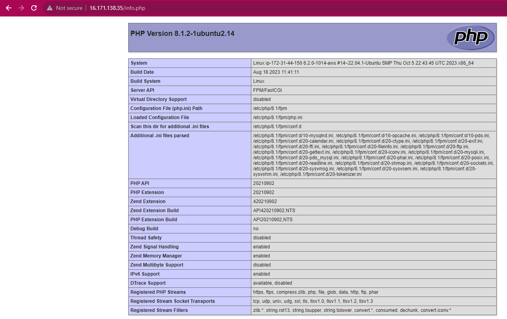
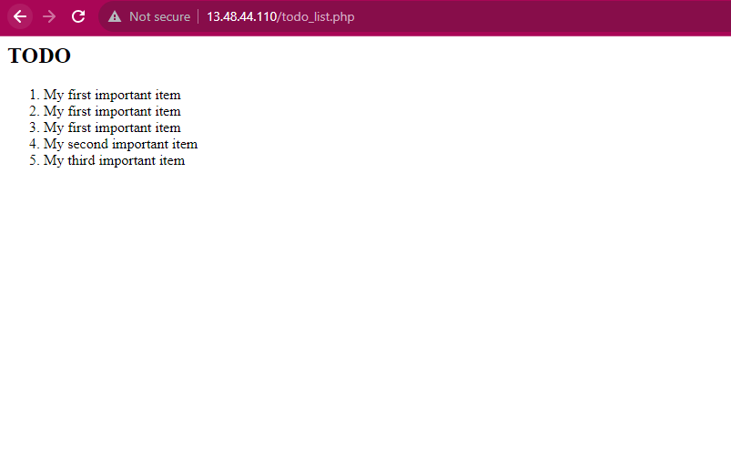

# **WEB STACK IMPLEMEENTATION**

# PREREQUISITE (LEMP STACK IMPLEMENTATION)

- An AWS free tier account
- An EC2 instance running on a virtual machine
- Ubuntu server OS running

## What is LAMP stack?

The LEMP stack is a popular web development stack that consists of Linux, Nginx, MySQL, and PHP. It is a variation of the more commonly known LAMP stack, which uses Apache instead of Nginx. The LEMP stack is used to build and deploy web applications and websites.

Here’s a brief overview of each component in the LEMP stack:

Linux: The operating system.
Nginx: The web server. It listens for HTTP requests and forwards them to the appropriate PHP script.
MySQL: The database. MySQL is used to store and manage the website’s data.
PHP: The programming language. PHP works with Nginx to help you create dynamic web pages.

### SSH into EC2 instance

Before proceeding, ensure that your AWS EC2 instance is up and running. Then, open Git Bash and execute the following steps:

1. Change your current directory to the "Download" folder using the command: `cd Download`. This command is necessary because it locates the folder where your private key has been downloaded.

Establish a secure connection to your EC2 instance by running the following SSH command:

`ssh -i <Your-private-key.pem> ubuntu@<EC2-Public-IP-address>`

Make sure to replace `<Your-private-key.pem>` with the name of your private key file and `<EC2-Public-IP-address>` with the public IP address of your EC2 instance. This will connect your terminal to the server.

## INSTALLING THE NGINX WEB SERVER

To install NGINX on your server, you can follow the instructions below:

- Update the package repository: `sudo apt update`

- Install Nginx: `sudo apt install nginx`

- To verify that nginx was successfully installed and running as a service in Ubuntu, run: `sudo systemctl status nginx`

- To check if you can access the server locally on our Ubuntu shell, run:

`curl http://localhost:80` or `curl http://127.0.0.1:80`

- How to test if the Nginx server is responding to requests from the internet

- Another way to retrieve your Public IP address, other than to check it in AWS Web console, is to use the following command:

curl -s http://169.254.169.254/latest/meta-data/public-ipv4

## INSTALLING MySQL

To install MySQL, you can follow the general steps below:

- Update the package repository: `sudo apt update`
- Install the MySQL server package: `sudo apt install mysql-server`

- When the installation is finished, log in to the MySQL console by typing: `sudo mysql`

Before running a security script that will remove some insecure default settings and lockdown access to your database system, we need to set a password for the root user, using mysql_native_password as default authentication method. We are defining the user's password as Password123$

- To set the root user password, Run ALTER USER 'root'@'localhost' IDENTIFIED WITH mysql_native_password BY 'PassWord123$'; 

- Then we exit MySQL shell with the `exit` or `quit` command

- Then we start the interactive script by running: `sudo mysql_secure_installation`

- When done, test if you are able to login to the MySQL console by typing: `sudo mysql -p`

- Please take note of the `-p` flag in this command. It will trigger a prompt where you can enter the new root user password after it has been changed.

- To exit the MySQL console, type: `exit`

## INSTALLING PHP

Once Nginx is installed for content delivery and MySQL is set up for data storage and management, the next step is to install PHP. PHP will handle code processing and generate dynamic content for the web server.

Nginx does not have a built-in PHP interpreter, so it needs an additional program to handle PHP processing and act as a bridge between the PHP interpreter and the web server. This program is called php-fpm (PHP FastCGI Process Manager).

To get PHP working with Nginx, you need to:

1. Install php-fpm.
2. Configure Nginx to pass PHP requests to php-fpm.
3. Install PHP and MySQL (if you need to use MySQL).

To install `php-fpm` and `php-mysql` together at once, run: `sudo apt install php-fpm php-mysql`

## CONFIGURING NGINX TO USE PHP PROCESSOR

Using Nginx server blocks, we can host multiple domains on a single server. For example, we can create a server block for the domain name `projectLEMP`.

By default, Nginx serves documents out of the directory /var/www/html. This works well for a single site, but can be difficult to manage for multiple sites.

Instead of modifying `/var/www/html`, we can create a directory structure within `/var/www` for the `projectLEMP` website. We can leave `/var/www/html` in place as the default directory to be served if a client request does not match any other sites.

To create the root web directory for `your_domain`, run: `sudo mkdir /var/www/projectLEMP`

Now, proceed by assigning ownership of the directory using the $USER environment variable, which corresponds to your current system user. To do this, execute the following command: `sudo chown -R $USER:$USER /var/www/projectLEMP`

To open a new configuration file in the Nginx site-available directory, using your preferred command line editor, run the following command:

`sudo nano /etc/nginx/sites-available/projectLEMP`

This will create a new blank file. Paste in the following bare-bones configuration:

What each of these directives and location blocks do:

`listen`- Defines what port NginX will listen on. In this case, it will listen on port `80` ,the default port for HTTP.

`root` -Defines the document root where the files served by this website ar stored.

`index` - Defines in which order Nginx will prioritize index files for this website. It is a commnon practice to list `index.html` files with a higher precedence than `index.php` files to allow for quickly setting up a maintenance landing page in PHP applications. You can adjust these settings to better suit your application needs.

`server_name` - Defines which domain names and/or IP addresses this server block should respond for. **Point this directive to your server's domain name or public IP address.**

`location /`-The first location block includes a `try_files` directive, which checks for the existence of files or directories matching a URl request. If Nginx cannot find the appropriate resource, it will return a 404 error.

`location ~ \.php$`- This location block handles the actual PHP processing by pointing Nginx to the fastcgi-php.conf configuration file and the `php7.4-fpm.sock file`, which declares what socket is associated with `php-fpm`.

`location ~ /\.ht` - The last location block deals with `.htaccess` files, which Nginx does not process. By adding the deny all directive, if `.htaccess` files happen to find their way into the document root ,they will not be served to visitors.

To activate your configuration, link the configuration file from Nginx's `sites-available` directory to the `sites-enabled` directory. Run the following command:

`sudo ln -s /etc/nginx/sites-available/projectLEMP /etc/nginx/sites-enabled/`

Test configuration for syntax error by typing: `sudo nginx -t`

To disable default Nginx host that is currently configured to listen on port 80,run: `sudo unlink /etc/nginx/sites-enabled/default`

Reload nginx by running: `sudo systemctl reload nginx`

Our new server block is now active. However, our website is not yet accessible because the web root directory, `/var/www/projectLEMP`, is empty.

Lets test our new server block and make sure that it is working as expected, create an `index.html` file in the projectLEMP directory by running this command:

`sudo echo 'Hello LEMP from hostname' $(curl -s http://169.254.169.254/latest/meta-data/public-hostname) 'with public IP' $(curl -s http://169.254.169.254/latest/meta-data/public-ipv4) > /var/www/projectLEMP/index.html`

Now run `http://<Public-IP-Address>:80` on browser to open website using IP Address

We can also access your website in your website by public DNS name, not only by IP.

Now, the LEMP stack is fully configured. Next step is to creat a PHP script that will test Nginx is in fact able to handle `.PHP` files within the newly configured website

## TESTING PHP WITH NGINX

Lets test to validate that Nginx can correctly hand .PHP files off to your PHP processor.

- Create a test PHP file in the document root. Open a new file called `info.php` within your document root in your text editor: `nano /var/www/projectLEMP/info.php`

Type the following lines into the new file. This is a valid PHP code that will return information about the server: 

`<?php`

`phpinfo();`

Then access the page on the browser with the command: `http://`server_domain_or_IP`/info.php` 

After checking the relevant information about the PHP server, its bestto remove the file as it contains sensitive information. To do that, run: `sudo rm /var/www/your_domain/info.php`

## RETRIEVING DATA FROM MYSQL DATABASE WITH PHP

We're about to set up a sample database named "`example_database`" and establish a username called "`example_user`." This user will be created using the "m`ysql_native_password`" authentication method. This specific method is chosen to ensure seamless connectivity to the MySQL database from PHP. It's worth noting that, as of now, the native MySQL PHP library, `mysqlnd`, does not support the "`caching_sha2_authentication`," which is the default authentication method for MySQL 8.

- Connect to the MySQL console using the root account: `sudo mysql -p`

- To create a new database, run: `mysql> CREATE DATABASE example_database;`

- Next, we create a new user and grant him full privileges on the database just created and password. To do so, run; `CREATE USER 'example_user'@'%' IDENTIFIED WITH mysql_native_password BY 'PassWord123$';`

Use any password of your choice

- Give the newly created user permission over the database by running the command below; `mysql> GRANT ALL ON example_database.* TO 'example_user'@'%';`

- Then exit the console

- Now, test to see if the new user has proper permission by running: 
`mysql -u example_user -p`

- Confirm that there is access to the `example_database` database by running: `mysql>SHOW DATABASES;`

- Next is to create a table named `todo_list`. To do so, run: `CREATE TABLE example_database.todo_list (item_id INT AUTO_INCREMENT,content VARCHAR(255),PRIMARY KEY(item_id));`

- Insert a few rows of content in the test table. 

`INSERT INTO example_database.todo_list (content) VALUES ("My first important item");`

- To confirm if the data is saved into the table, run: `SELECT * FROM example_database.todo_list;`

- Then exit MySQL management

- To create a PHP script that will connect with the Mysql database and query for your content. Create a php file in your custom web root directory using nano editor.

 Run: `nano /var/www/projectLEMP/todo_list.php`

Then copy this content into your `todo_list.php`

Save and close the file when you are done editing.

- You can now access this page in your web browser by visiting the domain name or public IP address configured for your website, followed by `/todo_list.php`

# END OF LEMP STACK PROJECT

