# INTRODUCTION TO SHELL SCRIPTING AND USER INPUT

## What is a Shell?

 A shell refers to a user interface that provides access to the services of an operating system. It is a command-line interface (CLI) that allows users to interact with the computer by typing commands. The shell interprets these commands and executes them by communicating with the operating system's kernel.

 ## What is Shell Scripting?

 Shell scripting is a way of automating tasks and processes in Linux. It involves writing a sequence of commands in a file and then executing them. This saves time because you don’t have to write certain commands again and again. You can perform daily tasks efficiently and even schedule them for automatic execution. You can also set certain scripts to execute on startup such as showing a particular message on launching a new session or setting certain environment variables. The applications and uses of scripting are numerous.

 ### Shell Scripting Syntax Elements

 1. **Variables**: Variables store and manipulate data that can be accessed throughout the script. Its defined using the `=` operator and referenced using the `$` symbol. 

 - To assign value to a variable: `name="John"`

 - Retrieving value from a variable: `echo $name`

 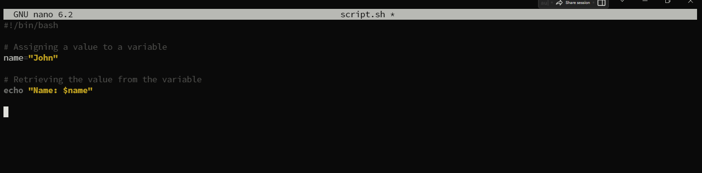

 The result is:

 

 2. **Control Flow**: Control flow plays a crucial role in directing the program's execution based on various conditions and situations. It allows your scripts to make decisions, iterate over tasks, and adapt their behavior. 

 - Using *if-else* to execute script based on a conditions

The above code prompts you to type a number and prints a statement stating the number is positive or negative. See result below

- Iterating through a list using a *for* loop

The result is:

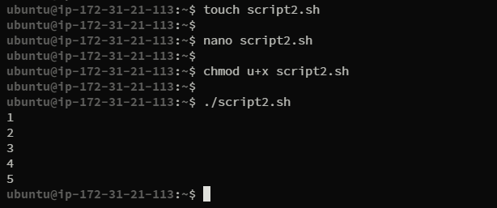

3. **Command Substitution**: Allows me to capture the output of a command and use it as a value within my script. We can use the backtick or the $() syntax for command substitution.

- Using backtick for command substitution;

` current_date=`date +%Y-%m-%d` `

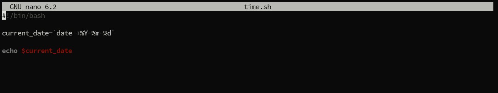

The result is:

- Using `$()` syntax for command substitution

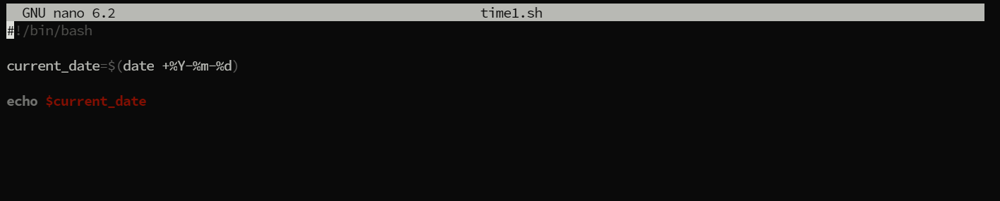

The result is:

4. **Input and Output:** To accept user input, we use the read command, output text to the console using the echo command. Additionally we can redirect input and output using operators like > (output to a file), < (input from a file) and | (pipe the output of one command as input to another)

- Accept user input

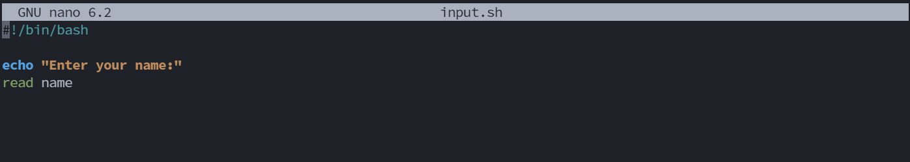

The result is:

- Output text to the terminal

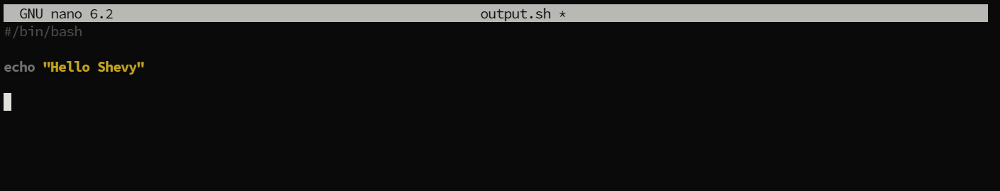

The result is: 

- Out the result of a command into a file

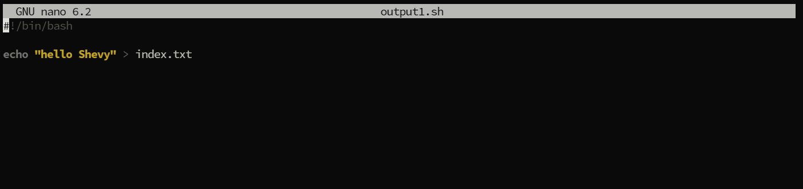

The result is: 

- Pass the content of a file as input to a command 

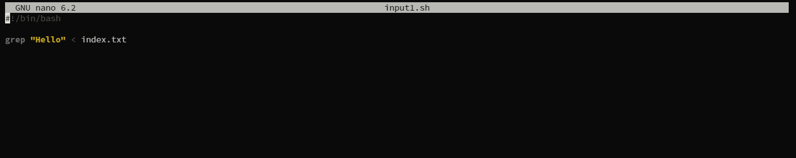

The result is:

- Pass the result of a command as input to another command

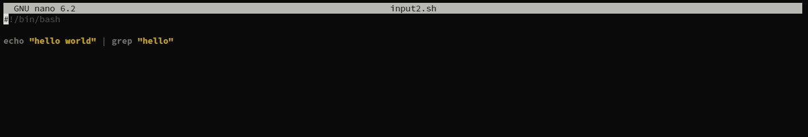

The result is:

5. **Functions:** Functions are used to modularize codes and make it more reusable, we can define a function using the function keyword or simply by declaring the function name followed by parentheses.

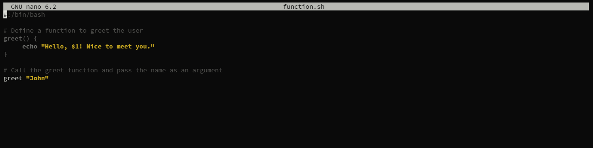

The result is:

## WRITING A SHELL SCRIPT

To write our first shell script, we need to create a shell file (.sh) to run. Follow the below step to write your first shell script

- Create a folder with the name *shell-scripting* where all the files we are going to run will be kept. To do so, run `mkdir shell-scripting`

- Change directory into the created folder so that every file we run or create will be automatically be created in the newly created folder. Run `cd shell-scripting`

- Create a file with the name user-input and ending with the extension .sh so that it can be executable. To do so, run `user-input.sh`

- Open the newly created `user-input.sh` file with a code editor and paste the following code into it then save. To open the file, run `nano user-input.sh` and paste the below code into it 

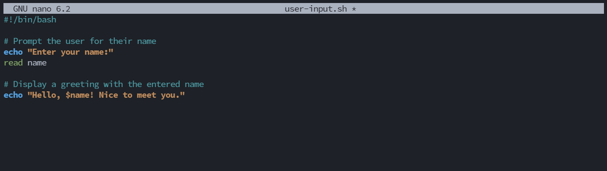

- After pasting the above code, you have to change the file permission so that it can be executable. to do that, we have to use the change mode command to modify the file. 

Run `chmod +x user-input.sh`. This command changes the file permission *user-input.sh* to be executable 

- Then run the script with the `./` command. To run the script, Run `./user-input.sh` which execute the file with the code being written into it

## DIRECTORY MANIPULATION AND NAVIGATION

To write a script that will display the current directory, create a new directory called `my_directory`change to that directory, create two new files inside it, list the files and move back one level up, remove the `my_directory` and its contents and finally list the file in the current directory.

- Create a new file and name it *navigating-linux-filesystem.sh*. To do so, RUn `touch navigating-linux-filesystem.sh`

- Open the code editor with the nano command and paste the following code that does as we want it to do. 

`# Display current directory`
`echo "Current directory: $PWD`"

`# Create a new directory`
`echo "Creating a new directory..."`

`mkdir my_directory`

`echo "New directory created."`

`# Change to the new directory`

`echo "Changing to the new directory..."`

`cd my_directory`

`echo "Current directory: $PWD"`

`# Create some files`

`echo "Creating files..."`

`touch file1.txt`

`touch file2.txt`

`echo "Files created."`

`# List the files in the current directory`

`echo "Files in the current directory:"`

`ls`

`# Move one level up`

`echo "Moving one level up..."`

`cd ..`

`echo "Current directory: $PWD"`

`# Remove the new directory and its contents`

`echo "Removing the new directory..."`

`rm -rf my_directory`

`echo "Directory removed."`

`# List the files in the current directory again`

`echo "Files in the current directory:"`

`ls`

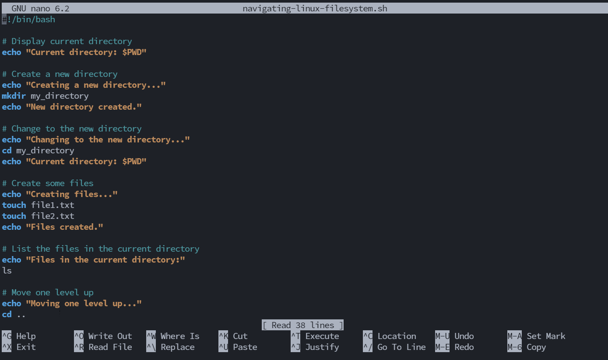

- Run `chmod +x navigating-linux-filesystem.sh` to make the file executable

- Execute the script by using the *./* command to execute the script. Run `./navigating-linux-filesystem.sh`

## FILE OPERATION AND SORTING

To write a script that can create three files (file1.txt,file2.txt and file3.txt),display the file in their current order, sort them alphabetically,save the sorted files in the (sorted_files.txt) display the sorted files,removes the original files,rename the sorted files to sorted_files_sorted_alphabetically.txt and finally display the content of the final sorted files.

- Create a file with the name *sorting.sh*. To do so, Run `touch sorting.sh`

- Open the file with the code editor *nano*. Paste the below code and save 

`# Create three files`

`echo "Creating files..."`

`echo "This is file3." > file3.txt`

`echo "This is file1." > file1.txt`

`echo "This is file2." > file2.txt`

`echo "Files created."`

`# Display the files in their current order`

`echo "Files in their current order:"`

`ls`

`# Sort the files alphabetically`

`echo "Sorting files alphabetically..."`

`ls | sort > sorted_files.txt`

`echo "Files sorted."`

`# Display the sorted files`

`echo "Sorted files:"`

`cat sorted_files.txt`

`# Remove the original files`

`echo "Removing original files..."`

`rm file1.txt file2.txt file3.txt`

`echo "Original files removed."`

`# Rename the sorted file to a more descriptive name`

`echo "Renaming sorted file..."`

`mv sorted_files.txt sorted_files_sorted_alphabetically.txt`

`echo "File renamed."`

`# Display the final sorted file`

`echo "Final sorted file:"`

`cat sorted_files_sorted_alphabetically.txt`

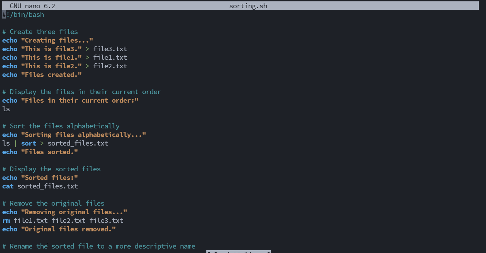

- Run the code `chmod +x sorting.sh` to make the file executable

- Execute the script by using the *./* command to execute the script. Run `./sorting.sh`

## WORKING WITH NUMBERS AND CALCULATIONS

To write a script that defines two variables num1 and num2, with numeric values, perform basic arithmethic operations (addition,subtraction,multiplication,division and modules) and display its results. it also perform more complex operation such as raising numb1 to power 2 and calculatin the square root of num2, and display those results as well.

- Create a file with the name *calculation.sh* by running the command `touch calculation.sh`

- Open the file *calculation.sh* by using the nano code editor. Run `nano calculation.sh`

- Paste the below code in the code editor

`# Define two variables with numeric values`

`num1=10`

`num2=5`

`# Perform basic arithmetic operations`

`sum=$((num1 + num2))`

`difference=$((num1 - num2))`

`product=$((num1 * num2))`

`quotient=$((num1 / num2))`

`remainder=$((num1 % num2))`

`# Display the results`

`echo "Number 1: $num1"`

`echo "Number 2: $num2"`

`echo "Sum: $sum"`

`echo "Difference: $difference"`

`echo "Product: $product"`

`echo "Quotient: $quotient"`

`echo "Remainder: $remainder"`

`# Perform some more complex calculations`

`power_of_2=$((num1 ** 2))`

`square_root=$(echo "sqrt($num2)" | bc)`

`# Display the results`

`echo "Number 1 raised to the power of 2: $power_of_2"`

`echo "Square root of number 2: $square_root"`

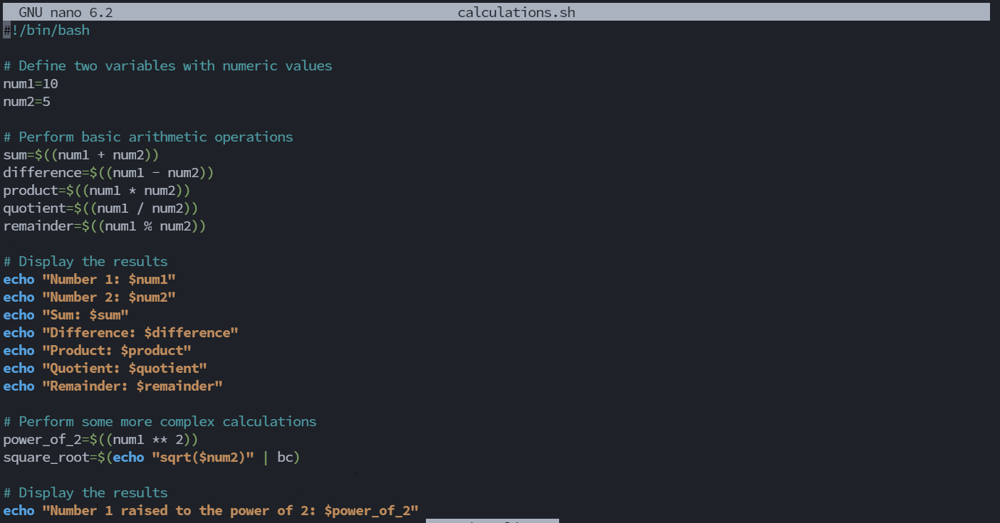

- To make the *calculations.sh* file executable Run `chmod +x calculations.sh`

- Execute the script by using the *./* command to execute the script. Run `./calculations.sh`

## FILE BACKUP AND TIMESTAMPING

This script defines source directory and backup directory paths. it then create timestamps using the current date and time,and create a backup directory with the timestamp appended to its name. The script then copies all files from the source directory to the backup directory using the cp command with -r option for recursive coping. Finally,it displays a message indicating the completion of the backup process and shows the path of the backup directory with the timestamp

- Create a file with the name `backup.sh` using the `touch backup.sh` command

- Open the file using the nano code editor. Run `nano backup.sh` command and paste the below code in it

`# Define the source directory and backup directory`

`source_dir="/home/ubuntu/shell-scripting"`

`backup_dir="/home/ubuntu/shevy"`

`# Create a timestamp with the current date and time`

`timestamp=$(date +"%Y%m%d%H%M%S")`

`# Create a backup directory with the timestamp`

`backup_dir_with_timestamp="$backup_dir/backup_$timestamp"`

`# Create the backup directory`

`mkdir -p "$backup_dir_with_timestamp"`

`# Copy all files from the source directory to the backup directory`

`cp -r "$source_dir"/* "$backup_dir_with_timestamp"`

`# Display a message indicating the backup process is complete`

`echo "Backup completed. Files copied to: $backup_dir_with_timestamp"`

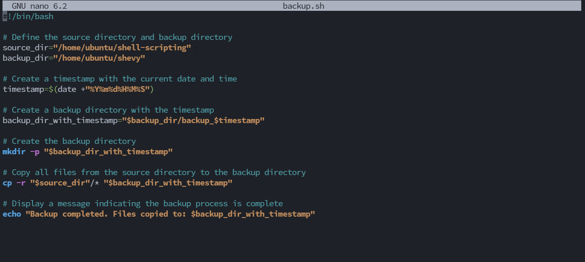

- To make the *backup.sh* file executable Run `chmod +x backup.sh`

- Execute the script by using the *./* command to execute the script. Run `./backup.sh`

# END OF SHELL SCRIPTING PROJECT

