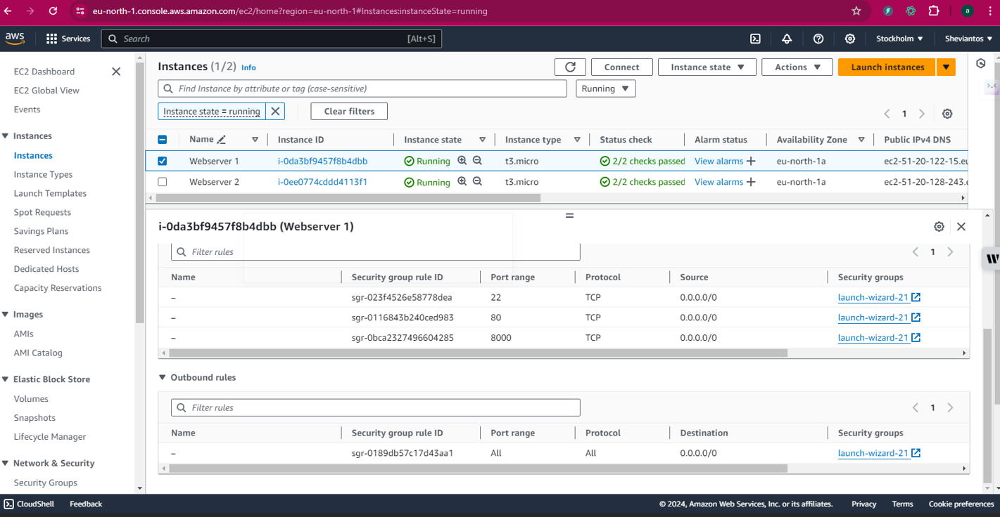
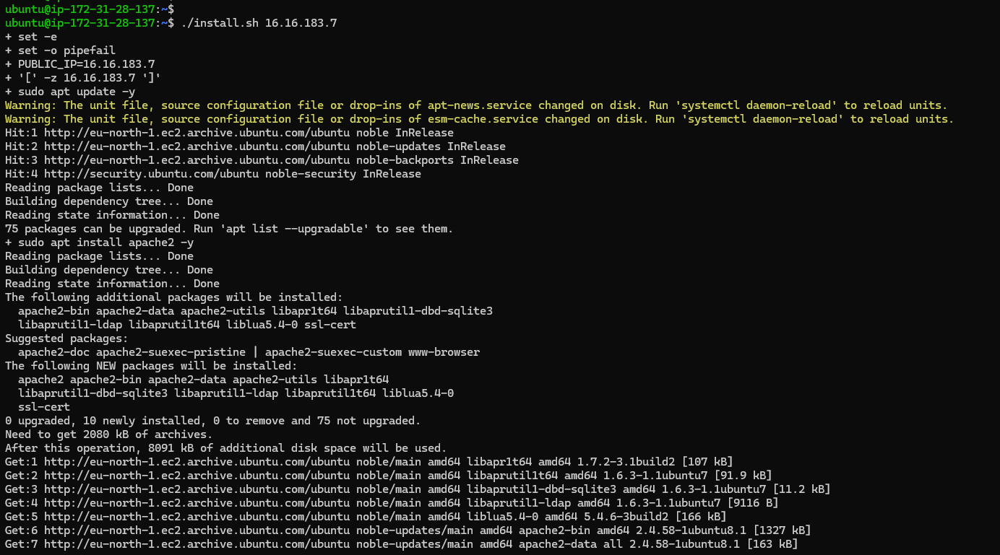

# AUTOMATING LOAD-BALANCER CONFIGURATION WITH SHELL SCRIPTING

Automating load-balancer configuration with shell scripting means using a script written in a shell scripting language (like Bash) to automatically set up, configure, and manage a load balancer. This process eliminates the need for manual intervention by system administrators, ensuring consistency, saving time, and reducing the likelihood of error.

## AUTOMATE THE DEPLOYMENT OF WEBSERVERS

We are going to deploy two backend servers, with a load balancer distributing traffic across the webservers. We will achieve that by writing a shell script that will automate the deployment for us. Automation helps speed up the deployment of services and reduces the chances of naking errors in our day to day activity.

### DEPLOYING AND CONFIGURING THE WEBSERVERS

1. Provision 2 EC2 instances and open port 80 and 8000 simultaneously to allow traffic from anywhere

Also open port 80 and 8000 for Webserver2

2. Connect to the webserver via the terminal using SSH client and run `sudo apt update -y` to update the package list

3. Open a file, paste the script below and close the file using the command: `sudo vi install.sh`

``#!/bin/bash`

``####################################################################################################################`
``##### This automates the installation and configuring of apache webserver to listen on port 8000`
`##### Usage: Call the script and pass in the Public_IP of your EC2 instance as the first argument as shown below:`
`######## ./install_configure_apache.sh 127.0.0.1`
`####################################################################################################################`

`set -x # debug mode`
`set -e # exit the script if there is an error`
`set -o pipefail # exit the script when there is a pipe failure`

`PUBLIC_IP=$1`

`[ -z "${PUBLIC_IP}" ] && echo "Please pass the public IP of your EC2 instance as an argument to the script" && exit 1`

`sudo apt update -y &&  sudo apt install apache2 -y`

`sudo systemctl status apache2`

`if [[ $? -eq 0 ]]; then`
    `sudo chmod 777 /etc/apache2/ports.conf`
    `echo "Listen 8000" >> /etc/apache2/ports.conf`
    `sudo chmod 777 -R /etc/apache2/`

    `sudo sed -i 's/<VirtualHost \*:80>/<VirtualHost *:8000>/' /etc/apache2/sites-available/000-default.conf`

`fi`
`sudo chmod 777 -R /var/www/`
`echo "<!DOCTYPE html>`
        `<html>`
        `<head>`
            `<title>My EC2 Instance</title>`
        `</head>`
        `<body>`
            `<h1>Welcome to my EC2 instance</h1>`
            `
Public IP: "${PUBLIC_IP}"
`
        `</body>`
        `</html>" > /var/www/html/index.html`

`sudo systemctl restart apache2`

3. Change the permission on the file to make an executable using the command: `sudo chmod +x install.sh`

4. Run the shell using the command: ./install.sh PUBLIC_IP

5. Test the program to see if it works

Now run step 2 to Step 5 for the second webserver and test it also.

## DEPLOYING OF NGINX AS A LOAD BALANCER USING SHELL SCRIPT

Since we have successfully deployed and configure the 2 webservers, now lets Deploy Nginx as a Loadbalancer

1. Create another EC2 and have port 80 opened

2. Run `sudo apt update -y` to update the packages

3. Open a file nginx.sh on your terminal using the command: `sudo vi nginx.sh`

4. Copy and paste the below script inside the file

`#!/bin/bash`

`######################################################################################################################`
`##### This automates the configuration of Nginx to act as a load balancer`
`##### Usage: The script is called with 3 command line arguments. The public IP of the EC2 instance where Nginx is installed`
`##### the webserver urls for which the load balancer distributes traffic. An example of how to call the script is shown below:`
`##### ./configure_nginx_loadbalancer.sh PUBLIC_IP Webserver-1 Webserver-2`
`#####  ./configure_nginx_loadbalancer.sh 127.0.0.1 192.2.4.6:8000  192.32.5.8:8000`
`############################################################################################################# `

``PUBLIC_IP=$1`
`firstWebserver=$2`
`secondWebserver=$3`

[ -z "${PUBLIC_IP}" ] && echo "Please pass the Public IP of your EC2 instance as the argument to the script" && exit 1

[ -z "${firstWebserver}" ] && echo "Please pass the Public IP together with its port number in this format: 127.0.0.1:8000 as the second argument to the script" && exit 1

[ -z "${secondWebserver}" ] && echo "Please pass the Public IP together with its port number in this format: 127.0.0.1:8000 as the third argument to the script" && exit 1

set -x # debug mode
set -e # exit the script if there is an error
set -o pipefail # exit the script when there is a pipe failure

sudo apt update -y && sudo apt install nginx -y
sudo systemctl status nginx

if [[ $? -eq 0 ]]; then`
    sudo touch /etc/nginx/conf.d/loadbalancer.conf

    sudo chmod 777 /etc/nginx/conf.d/loadbalancer.conf
    sudo chmod 777 -R /etc/nginx/

    
    echo " upstream backend_servers {

            # your are to replace the public IP and Port to that of your webservers
            server  "${firstWebserver}"; # public IP and port for webserser 1
            server "${secondWebserver}"; # public IP and port for webserver 2

            }

            `server {`
            `listen 80;`
            `server_name "${PUBLIC_IP}";`

            `location / {`
                `proxy_pass http://backend_servers;`   
            `}`
    `} " > /etc/nginx/conf.d/loadbalancer.conf`
`fi`

`sudo nginx -t`

`sudo systemctl restart nginx`

5. Change the permission to make it an executable using the command: `sudo chmod +x nginx.sh`

6. Run the script with the command: `./nginx.sh PUBLIC_IP Webserver-1 Webserver-2`

Verify the setup. The Loadbalancing content should switch between the 2 webservers when page is refreshed

It shows the first page above, after refreshing the page, it shows the page below

# THANK YOU!!!