# IMPLEMENTING WORDPRESS WEBSITE WITH LVM STORAGE MANAGEMENT

Implementing a WordPress website with LVM (Logical Volume Manager) storage management involves setting up a server with LVM partitions and using these partitions to store your WordPress files and database. LVM offers flexibility and manageability for your WordPress storage. 

## UNDERSTANDING 3 TIER ARCHITECTURE

The 3-tier architecture is a client-server software architecture pattern that consists of three separate layers:

1. Presentation Layer: This layer deals with the user interface and presentation of the application. It is where the interaction between the user and the application takes place.

2. Business or Application Layer: The business layer contains the logic and rules of the application. This layer processes the user inputs and produces outputs based on the defined business logic.

3. Data Access or Management Layer: This layer is responsible for interacting with the data storage systems, such as databases. It handles the storage and retrieval of data requested by the application.

In this project, we will have the hands-on experience that showcases Three-tier Architecture while also ensuring that the disks used to store files on the Linux servers are adequately partitiones and managed through programs such as `gdisk` and `LVM` respectively

# PREREQUISITE

1. A Laptop or PC to serve as a client
2. An EC2 Linux Server as a web server (This is where we will install Wordpress)
3. An EC2 Linux server as a database (DB) server

We are going to use RedHat OS(centos) or this project.

## IMPLEMENTING LVM ON LINUX SERVERS (WEB AND DATABASE SERVERS)

#### STEP 1: Prepare a Web Server

- Create an AWS instance using RedHat Distribution that will serve as our 'Web Server'

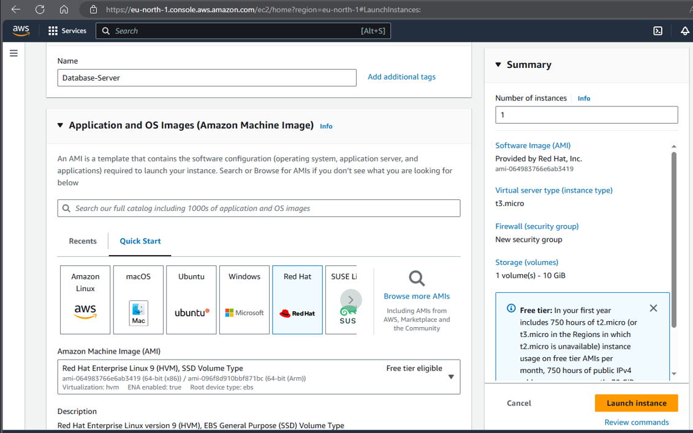

- Create 3 volumes in the same AZ as your Web Sevrer EC2, each of 10gb. Go to Volumes, click on create volumes, choose 10gb and make show the availability zone is same as your EC2 instance, then click Create Volume. Repeat the process 3 times to create three volumes

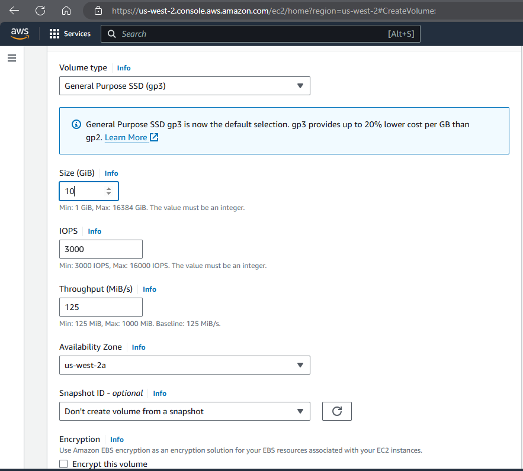

- Attach all three volumes one by one to your Web Server EC2 instance. Click on each volumes created, then click actions and you will see Attach Volume. Under instance, pick the WebServer instance and under Device name, pick `/dev/sdf`, `/dev/sdg` and `/dev/sdh` respectively

- Connect your instance to Linux terminal to begin configuration. Use `lsdlk` command to inspect what block devices are attached to the server. Notice names of your newly created devices. All devices in Linux reside in `/dev/directory`. Inspect it with `ls/dev/` and make sure you see all 3 newly created block devices there - their names will likely be `xvdf`,`xvdh`,`xvdg`. 

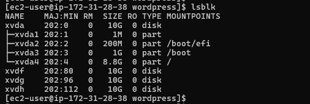

- Use `df -h` command to see all mounts and free space on your server

- Use `gdisk` utility to create a single partition on each of the 3 disks 

`sudo gdisk /dev/xvdf`. Press n to add a new partition, p to print the partition table, w to write table to disk and exit

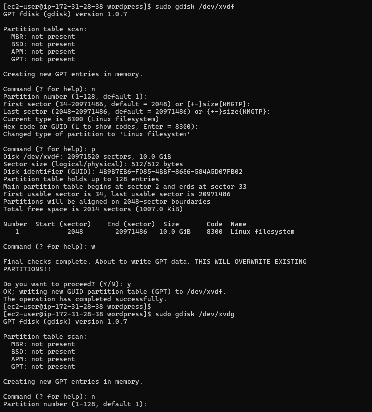

`sudo gdisk /dev/xvdg`. Press n to add a new partition, p to print the partition table, w to write table to disk and exit

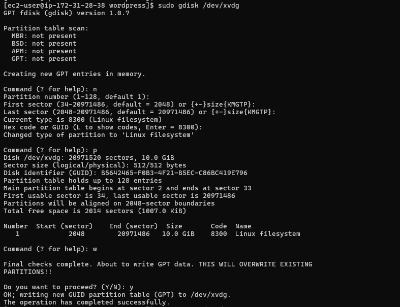

`sudo gdisk /dev/xvdh`. Press n to add a new partition, p to print the partition table, w to write table to disk and exit

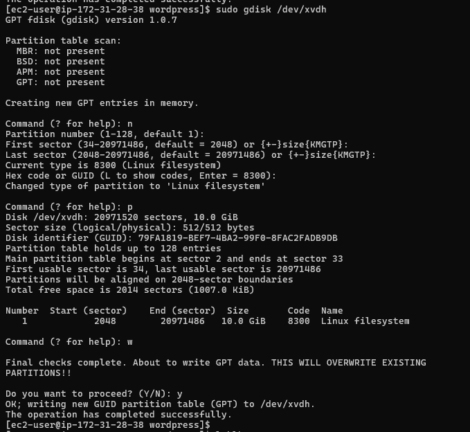

- Use `lsblk` utility to view the newly configured partition on each of the 3 disks. 

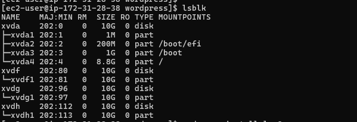

- Install `lvm2` package using `sudo yum install lvm2`. Run sudo `lvmdiskscan` command to check for available partitions

- Use `pvcreate` utility to mark each of 3 disks as physical volumes (PVs) to be used by LVM

`sudo pvcreate /dev/xvdf1` `sudo pvcreate /dev/xvdg1` `sudo pvcreate /dev/xvdh1`

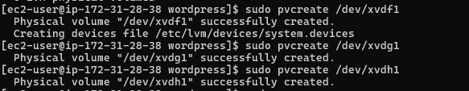

- Verify that your Physical volume has been created successfully by running `sudo pvs`

- Use `vgcreate` utility to add all 3 PVs to a volume group (VG). Name the VG webdata-vg

`sudo vgcreate webdata-vg /dev/xvdh1 /dev/xvdg1 /dev/xvdf1`

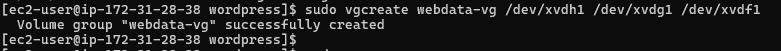

- Verify that your VG has been created successfully by running `sudo vgs`

- Use `lvcreate` utility to create 2 logical volumes. apps-lv(use half of the PV size), and logs-lv Use the remaining space of the PV size. NOTE: apps-lv will be used to store data for the Website while, logs-lv will be used to store data for logs.

`sudo lvcreate -n apps-lv -L 14G webdata-vg`
`sudo lvcreate -n logs-lv -L 14G webdata-vg`

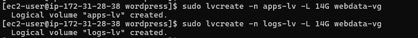

- Verify that your Logical Volume has been created successfully by running `sudo lvs`

- Verify the entire setup

`sudo vgdisplay -v #view complete setup - VG, PV, and LV`

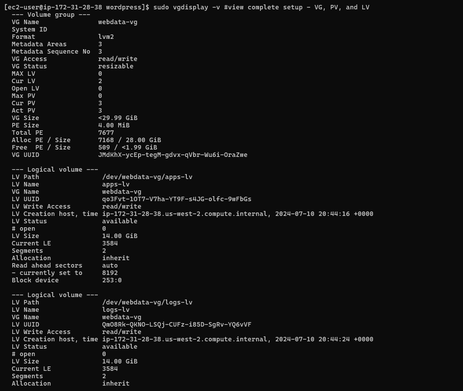

`sudo lsblk`

- Use `mkfs.ext4` to format the logical volumes with `ext4` filesystem

`sudo mkfs -t ext4 /dev/webdata-vg/apps-lv`

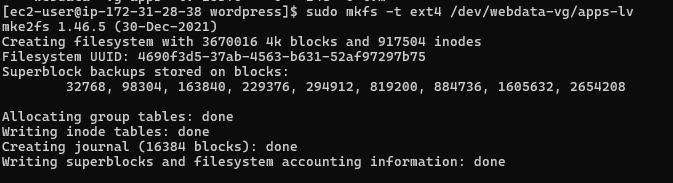

`sudo mkfs -t ext4 /dev/webdata-vg/logs-lv`

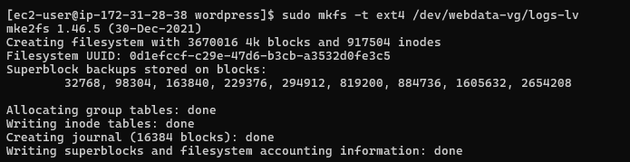

- Create /var/www/html directory to store website files

`sudo mkdir -p /var/www/html`

- Create /home/recovery/logs to store backup of log data

`sudo mkdir -p /home/recovery/logs`

- Mount /var/www/html on apps-lv logical volume

`sudo mount /dev/webdata-vg/apps-lv /var/www/html/`

- Use `rsync` utility to backup all the files in the log directory /var/log into /home/recovery/logs (This is require before mounting the file system)

`sudo rsync -av /var/log/. /home/recovery/logs/`

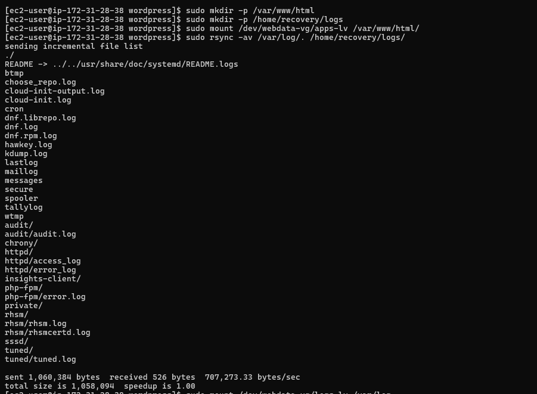

- Mount `/var/log` on logs-lv logical volume. (Note that all the existing data on `/var/log` will be deleted)

`sudo mount /dev/webdata-vg/logs-lv /var/log`

- Restore log files back into /var/log directory

`sudo rsync -av /home/recovery/logs/log/. /var/log`

- Update /etc/fstab file so the mount configuration will persist ater restart of the server. The UUID of the device will be used to update the /etc/fstab file;

`sudo blkid`

- `sudo vi /etc/fstab`. Update /etc/stab in this format using your own UUID and remember to remove the leading and ending quotes. 

- Test the configuration and reload the daemon

`sudo mount -a`
`sudo systemctl daemon-reload`

- Verify your setup by running df -h

# INSTALLING WORDPRESS AND CONFIGURING TO USE MYSQL DATABASE

#### STEP 2 - Prepare the Database Server

Launch a second Red Hat EC2 instance that will have a role - 'DB Server' Repeat the same steps as the Web Server, but instead of `apps-lv` create `db-lv` and mount it to `/db` directory instead of `/var/www/html/`.

- Create an EC2 instance DataBase-server on Redhat OS

- Create and attach 3 volumes to the Database-Server. To attach each Volume one by one to the Database-Server EC2 Instance. Click on the Volume and right click to select the attach option. Select the Web-server EC2 instance and click attach

- Connect the EC2 instance to the Terminal via ssh client. 

- To see the newly created devices, run `lsblk`

- To create a single partition on each of the 3 disks

`sudo gdisk /dev/xvdf`

`sudo gdisk /dev/xvdg`

`sudo gdisk /dev/xvdh`

- Run a new entry by entering n and click the number of partition in this case 1. Click yes to complete the process

- To install the lvm2 package, run `sudo yum install lvm2`

- To check for available partitions, run `sudo lvmdiskscan`

- To mark each of the three disks as physical Volumes(Pvs) to be used by LVM, run the below commands

`sudo pvcreate /dev/xvdf1 `

`sudo pvcreate /dev/xvdg1`

`sudo pvcreate /dev/xvdh1`

- To verify that the physical volume has been created successfully, run `sudo pvs`

- To add all the three Physical volumes(Pvs) to a Volume Group (VG). Name the VG webdata-vg

`sudo vgcreate webdata-vg /dev/xvdf1 /dev/xvdg1 /dev/xvdh1`

- To verify that the VG has been successfully created, run `sudo vgs`

- To create 2 logical volumes.apps-lv(Use half of the pv size), and logs-lv(Use the remaining space of the PV). Note: `Apps-lv` will be used to store data for the website while, `logs-lv` will be used to store data for logs.

`sudo lvcreate -n db-lv -L 14G webdata-vg`

`sudo lvcreate -n logs-lv -L 14G webdata-vg`

- To verify the logic Volumes has been created successfully, run `sudo lvs`

- To format the logical app and log Volumes with ext4 file system using mkfs.ext4

`sudo mkfs -t ext4 /dev/webdata-vg/db-lv`

`sudo mkfs -t ext4 /dev/webdata-vg/logs-lv`

- To create /db directory to store websites file. Run the below command. Mount it to /db (instead of var/www/html). Run `sudo mkdir -p /db`

- To create /home/recovery/logs to store back up of the logs data. Run the below command

`sudo mkdir -p /home/recovery/logs`

- To mount /db on db-lv logical volume

`sudo mount /dev/webdata-vg/db-lv /db`

- To back up files in the log directory /var/log into home/recovery/logs using the rsync utility

`sudo rsync -av /var/log/. /home/recovery/logs/`

- To update /etc/fstab so that the mount configuration will persist after restart. Copy the UUID of the device to upate the /etc/fstab

`sudo blkid`

- Run the below command and then past the UUIDs. Run `sudo vi /etc/fstab`

- To test the configuration and reload the Daemon

`sudo mount -a` 

`sudo systemctl daemon-reload`

- To verify the set up is running well. Run `df -h`

#### Step 3 - Install Wordpress on your Web Server EC2

- Run `sudo yum -y update` to update the repository

- Install wget, Apache and its dependencies

`sudo yum -y install wget httpd php php-mysqlnd php-fpm php-json`

- Start Apache and check status to see its enabled

`sudo systemctl enable httpd`

`sudo systemctl start httpd`

`sudo systemctl status httpd`

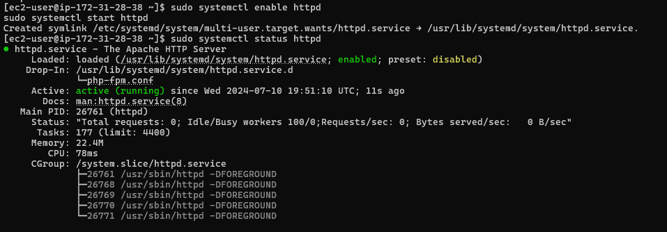

- To install PHP and its dependencies

`sudo yum install https://dl.fedoraproject.org/pub/epel/epel-release-latest-8.noarch.rpm`

`sudo yum install yum-utils http://rpms.remirepo.net/enterprise/remi-release-8.rpm`

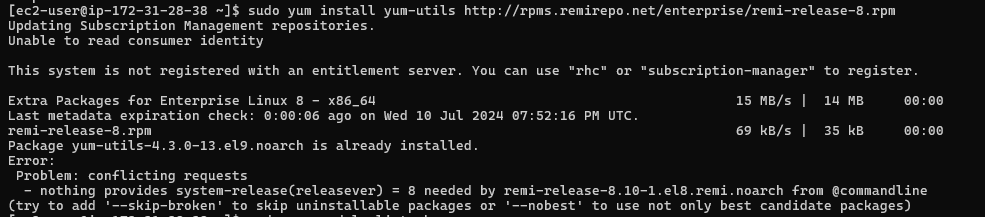

`sudo yum module list php`

`sudo yum module reset php`

`sudo yum module enable php:remi-7.4`

`sudo yum install php php-opcache php-gd php-curl php-mysqlnd`

`sudo systemctl start php-fpm`

`sudo systemctl enable php-fpm`

`setsebool -P httpd_execmem 1`

- Run `sudo systemctl restart httpd` to restart Apache

- To download wordpress and copy wordpress to var/www/html, run the below command;

`mkdir wordpress`

`cd   wordpress`

`sudo wget http://wordpress.org/latest.tar.gz`

`sudo tar xzvf latest.tar.gz`

`sudo rm -rf latest.tar.gz`

`cp wordpress/wp-config-sample.php wordpress/wp-config.php`

`cp -R wordpress /var/www/html/`

- Configure SELinux Policies

 `sudo chown -R apache:apache /var/www/html/wordpress`

 `sudo chcon -t httpd_sys_rw_content_t /var/www/html/wordpress -R`

 `sudo setsebool -P httpd_can_network_connect=1`

#### Step 4 - Install MySQL on your DBServer EC2

- To update the server and install mysql-server, run the below program

`sudo yum update`

`sudo yum install mysql-server`

- Verify that the service is up and running by using `sudo systemctl status mysqld`, if it is not running, restart the service and enable it so it will be running even after reboot:

`sudo systemctl restart mysqld`

`sudo systemctl enable mysqld`

#### Step 5 - Configure DB to work with WordPress

`sudo mysql`

`CREATE DATABASE wordpress;`

`CREATE USER `myuser`@`<Web-Server-Private-IP-Address>` IDENTIFIED BY 'mypass';`

`GRANT ALL ON wordpress.* TO 'myuser'@'<Web-Server-Private-IP-Address>';`

`FLUSH PRIVILEGES;`

`SHOW DATABASES;`

`exit`

#### Step 6 - Configure WordPress to connect to remote database

Hint: Do not forget to open MySQL 3306 on DB Server EC2. For extra security, you shall allow access to the DB server ONLY from your Web Server's IP address, so in the Inbound Rule configuration specify source as /32

- Install MySQL client and test that you can connect from your Web Server to your DB server by using `mysql-client`

`sudo yum install mysql`

`sudo mysql -u admin -p -h <DB-Server-Private-IP-address>`

- Verify if you can successfully execute SHOW DATABASES; command and see a list of existing databases.

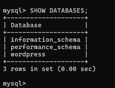

- Change permissions and configuration so Apache could use WordPress;

- Enable TCP port 80 in Inbound Rules configuration for your Web Server EC2 (enable rom everywhere 0.0.0.0/0 or from your workstation's IP)

- Try to access from your browser the link to your WordPress `http://<Web-Server-Public-IP-Address>/wordpress/`

Pick your preferred language and click continue when the page loads

Fill out the wordpress details to allow installation of Wordpress

Then click log in to take you to the login page 

Input the wordpress credentials used in setting up to enable successful login to wordpress

We have successfully deployed a full-scale Web Solution using WordPress Content Management System (CMS) and MySQL Relational Database Management Systsem (RDBMS).

## CONGRATULATIONS

